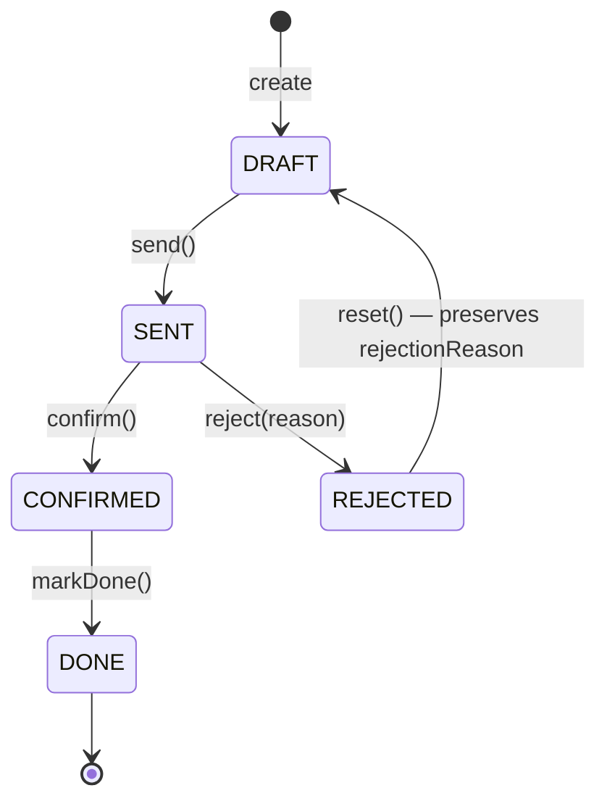

# Design Pattern Catalog — 6 patterns áp dụng

6 patterns được chọn lọc áp dụng vào AppBanHang. Mỗi pattern giải real problem trong codebase hiện tại, có file:line evidence. Chỉ pattern nào fit project scale (ước tính ~5000–7000 LOC BE, ~3700 LOC FE — dựa trên 13 controllers + 13 services + 18 entities + DTOs ≈ 80–100 file Java) mới được chọn.

> [!info] Triết lý
> Một dự án "xịn" tầm A- → A áp dụng 4–6 patterns đúng chỗ, không phải 15 patterns để liệt kê. Pattern không solve problem cụ thể = code smell ngược (over-engineering).

---

## Tiêu chí chọn pattern (DON'T over-engineer)

Mỗi pattern phải pass đủ 4 điều kiện:

1. **Solve >= 1 problem cụ thể** trong code hiện tại — có file:line evidence
2. **Fit project scale** — ước tính ~5000–7000 LOC BE + ~3700 LOC FE là quy mô vừa, không phải enterprise
3. **Tăng extensibility cho future requirement thực tế** trong SRS (UC1–UC21), không phải tưởng tượng
4. **Cost/benefit hợp lý** — pattern không tạo nhiều file boilerplate hơn LOC nó tiết kiệm

> [!warning] Patterns bị loại
> Singleton, Decorator, Visitor, Hexagonal Architecture, CQRS, Saga — xem section [Patterns we did NOT choose](#patterns-we-did-not-choose-and-why) ở dưới.

---

## Pattern 1 — Mapper Pattern (BE)

### Problem

Method `toDTO()` được copy-paste trong **14 file `*ServiceImpl.java`**. Mỗi lần thêm 1 field mới vào DTO (vd: `createdAt`, `updatedBy`) phải sửa 14 chỗ → vi phạm OCP, dễ miss một file → bug khó tìm.

> [!bug] Evidence
> Mọi file `services/impl/*ServiceImpl.java` đều có `private SomethingDTO toDTO(SomethingEntity e)` riêng. Logic mapping field-by-field gần như identical.

**Files affected**: `PurchaseOrderServiceImpl`, `WarehouseServiceImpl`, `StockInquiryServiceImpl`, `ProcessRequestServiceImpl`, `AccountServiceImpl`, `SiteServiceImpl`, `MerchandiseServiceImpl`, `NotificationServiceImpl`, `DiscrepancyServiceImpl`, `ReceiveServiceImpl`, `AuditServiceImpl`, `ImportRequestServiceImpl`, `TaskAssignmentServiceImpl`, `ReportServiceImpl`.

### Before

```java
// PurchaseOrderServiceImpl.java
private PurchaseOrderDTO toDTO(PurchaseOrder po) {
    PurchaseOrderDTO dto = new PurchaseOrderDTO();
    dto.setId(po.getId());
    dto.setCode(po.getCode());
    dto.setStatus(po.getStatus().name());
    dto.setSupplier(po.getSupplier());
    dto.setCreatedAt(po.getCreatedAt());
    dto.setTotalAmount(po.getTotalAmount());
    return dto;
}
```

### After (MapStruct — compile-time, zero-overhead)

```java
@Mapper(componentModel = "spring")
public interface PurchaseOrderMapper {
    PurchaseOrderDTO toDTO(PurchaseOrder po);
    List<PurchaseOrderDTO> toDTOs(List<PurchaseOrder> pos);

    @Mapping(target = "status", source = "status", qualifiedByName = "enumToString")
    PurchaseOrderDTO toDTOWithStatusName(PurchaseOrder po);

    @Named("enumToString")
    default String enumToString(POStatus s) { return s == null ? null : s.name(); }
}

// Trong service:
@Autowired private PurchaseOrderMapper mapper;
return mapper.toDTO(po); // 1 dòng
```

#### Cấu hình `annotationProcessorPaths` đúng thứ tự (Maven)

```xml
<plugin>
  <groupId>org.apache.maven.plugins</groupId>
  <artifactId>maven-compiler-plugin</artifactId>
  <configuration>
    <annotationProcessorPaths>
      <!-- 1) Lombok TRƯỚC để generate getters/setters -->
      <path>
        <groupId>org.projectlombok</groupId>
        <artifactId>lombok</artifactId>
        <version>1.18.46</version>
      </path>
      <!-- 2) MapStruct processor SAU Lombok để thấy được code đã generate -->
      <path>
        <groupId>org.mapstruct</groupId>
        <artifactId>mapstruct-processor</artifactId>
        <version>1.5.5.Final</version>
      </path>
      <!-- 3) Binding adapter CUỐI CÙNG để bridge 2 processor trên -->
      <path>
        <groupId>org.projectlombok</groupId>
        <artifactId>lombok-mapstruct-binding</artifactId>
        <version>0.2.0</version>
      </path>
    </annotationProcessorPaths>
  </configuration>
</plugin>
```

> [!warning] Thứ tự annotationProcessorPaths là quan trọng
> `lombok` → `mapstruct-processor` → `lombok-mapstruct-binding`. Sai thứ tự sinh ra MapStruct method body rỗng (Lombok chưa generate accessor lúc MapStruct chạy) — bug khó truy vết vì compile thành công nhưng runtime trả về null.

### SOLID impact

- **OCP** ✓ — Thêm field `approvedBy` chỉ cần thêm 1 dòng trong `PurchaseOrderDTO`, MapStruct tự generate; **không sửa 14 file**.
- **DRY** ✓ — Loại bỏ ~150 LOC duplicated mapping logic.
- **Type-safety** ✓ — MapStruct fail compile-time nếu field mismatch (so với ModelMapper là runtime).

> [!tip] Lý do chọn MapStruct hơn ModelMapper
> MapStruct generate code lúc build (xem `target/generated-sources/`), debug được, fast. ModelMapper dùng reflection → chậm và lỗi runtime.

---

## Pattern 2 — State Pattern (BE)

### Problem

`PurchaseOrderServiceImpl` có 4 method `sendPO`, `confirmPO`, `rejectPO`, `markDone` (line 159–220). Mỗi method **manual check** `po.getStatus()` rồi `throw IllegalStateException` nếu sai. Khi thêm state mới (`ARCHIVED`, `CANCELLED`) phải sửa cả 4 methods + thêm validation matrix.

> [!bug] Evidence
> `PurchaseOrderServiceImpl.java:159–220` lặp pattern `if (po.getStatus() != POStatus.DRAFT) throw new ...`.

### Before

```java
@Transactional
public void confirmPO(Long id) {
    PurchaseOrder po = repo.findById(id).orElseThrow();
    if (po.getStatus() != POStatus.SENT) {
        throw new IllegalStateException("Cannot confirm PO not in SENT state");
    }
    po.setStatus(POStatus.CONFIRMED);
    po.setConfirmedAt(LocalDateTime.now());
    repo.save(po);
    notificationService.notifyConfirmed(po);
}
```

(Tương tự cho `sendPO`, `rejectPO`, `markDone`. 4 methods × ~12 dòng = 48 dòng status-check boilerplate.)

### State diagram (Mermaid)



> [!info] Tại sao có cạnh `REJECTED → DRAFT`?
> Bug `rejectpo-loses-reason` (xem [[bugs/rejectpo-loses-reason]]) — khi PO bị reject, user phải sửa và gửi lại. Hiện state hiện tại bị reset `rejectionReason = null` → mất audit trail. State pattern thêm explicit `reset()` transition giữ `rejectionReason` nguyên vẹn để hiển thị lịch sử.

### After (State Pattern — chuẩn GoF với state reference trong entity)

**1. State interface + Registry singleton (no GC churn):**

```java
public interface POState {
    default void send(PurchaseOrder po)        { throw illegal("send"); }
    default void confirm(PurchaseOrder po)     { throw illegal("confirm"); }
    default void reject(PurchaseOrder po, String reason) { throw illegal("reject"); }
    default void markDone(PurchaseOrder po)    { throw illegal("markDone"); }
    default void reset(PurchaseOrder po)       { throw illegal("reset"); }
    default IllegalStateException illegal(String op) {
        return new IllegalStateException("Cannot " + op + " in state " + getClass().getSimpleName());
    }
}

// Registry: singleton instance per state — KHÔNG tạo mới mỗi call
public final class POStateRegistry {
    private static final Map<POStatus, POState> REGISTRY = Map.of(
        POStatus.DRAFT,     new DraftState(),
        POStatus.SENT,      new SentState(),
        POStatus.CONFIRMED, new ConfirmedState(),
        POStatus.REJECTED,  new RejectedState(),
        POStatus.DONE,      new DoneState()
    );
    public static POState get(POStatus s) { return REGISTRY.get(s); }
    private POStateRegistry() {}
}
```

**2. Entity giữ state reference (chuẩn GoF — không re-derive từ enum mỗi call):**

```java
@Entity
public class PurchaseOrder {
    @Enumerated(EnumType.STRING)
    private POStatus status;
    private String rejectionReason;

    @Transient
    private POState state;

    /** JPA load callback — khởi tạo state reference dựa trên enum đã persist. */
    @PostLoad
    void initState() { this.state = POStateRegistry.get(status); }

    /** Factory callback khi new — Spring/JPA gọi trước @PrePersist. */
    @PrePersist
    void initStateOnCreate() {
        if (this.status == null) this.status = POStatus.DRAFT;
        this.state = POStateRegistry.get(status);
    }

    // Public domain API — uỷ thác cho state hiện tại
    public void send()                            { state.send(this); }
    public void confirm()                         { state.confirm(this); }
    public void reject(String reason)             { state.reject(this, reason); }
    public void markDone()                        { state.markDone(this); }
    public void resetFromRejected()               { state.reset(this); }

    /** Chỉ state classes mới được gọi — package-private. */
    void applyTransition(POStatus next, POState nextState) {
        this.status = next;
        this.state  = nextState;
    }

    void setRejectionReason(String r) { this.rejectionReason = r; }
    // getters ...
}
```

**3. Concrete states (mỗi class = 1 file):**

```java
class DraftState implements POState {
    @Override public void send(PurchaseOrder po) {
        po.applyTransition(POStatus.SENT, POStateRegistry.get(POStatus.SENT));
    }
}

class SentState implements POState {
    @Override public void confirm(PurchaseOrder po) {
        po.applyTransition(POStatus.CONFIRMED, POStateRegistry.get(POStatus.CONFIRMED));
    }
    @Override public void reject(PurchaseOrder po, String reason) {
        if (reason == null || reason.isBlank())
            throw new IllegalArgumentException("Rejection reason required");
        po.setRejectionReason(reason);
        po.applyTransition(POStatus.REJECTED, POStateRegistry.get(POStatus.REJECTED));
    }
}

class RejectedState implements POState {
    /** Reset chuyển REJECTED → DRAFT NHƯNG giữ nguyên rejectionReason để audit. */
    @Override public void reset(PurchaseOrder po) {
        // rejectionReason giữ nguyên — chỉ chuyển state về DRAFT
        po.applyTransition(POStatus.DRAFT, POStateRegistry.get(POStatus.DRAFT));
    }
    // các thao tác khác đều illegal — phải reset trước
    @Override public void send(PurchaseOrder po)        { throw illegal("send (call reset first)"); }
    @Override public void confirm(PurchaseOrder po)     { throw illegal("confirm"); }
    @Override public void reject(PurchaseOrder po, String r) { throw illegal("reject (already REJECTED)"); }
}

class ConfirmedState implements POState {
    @Override public void markDone(PurchaseOrder po) {
        po.applyTransition(POStatus.DONE, POStateRegistry.get(POStatus.DONE));
    }
}

class DoneState implements POState {
    // terminal — mọi thao tác đều illegal
}
```

**4. Service shrinks — chỉ orchestrate, không còn status-matrix logic:**

```java
@Transactional
public void confirmPO(Long id) {
    PurchaseOrder po = repo.findById(id).orElseThrow();
    po.confirm();   // <-- entity delegate cho state, throw nếu illegal
    repo.save(po);
    eventPublisher.publishEvent(new POConfirmedEvent(po.getId())); // xem Pattern 4
}

@Transactional
public void rejectPO(Long id, String reason) {
    PurchaseOrder po = repo.findById(id).orElseThrow();
    po.reject(reason);
    repo.save(po);
    eventPublisher.publishEvent(new PORejectedEvent(po.getId(), reason));
}

@Transactional
public void resetRejectedPO(Long id) {
    PurchaseOrder po = repo.findById(id).orElseThrow();
    po.resetFromRejected();  // <-- rejectionReason giữ nguyên
    repo.save(po);
}
```

### SOLID impact

- **OCP** ✓ — Thêm `ArchivedState implements POState` + 1 entry registry, **không sửa service hay entity**.
- **SRP** ✓ — Mỗi state class = 1 trách nhiệm (rules cho state đó).
- **DDD-friendly** ✓ — Behavior nằm trong entity (rich domain model), không phải ServiceImpl (anemic).
- **Loại** "illegal state matrix scattered" smell — tập trung trong từng state class.

> [!tip] Khác biệt với "primitive state" (anti-pattern)
> - **Anti-pattern**: `POStateFactory.of(po.getStatus()).confirm(po)` rồi state class chỉ gọi `po.setStatus(...)`. Đây không phải State Pattern — chỉ là dispatcher rỗng. Factory recreate state mỗi call → GC noise. Entity không có state reference → mất nửa lợi ích DDD.
> - **Chuẩn GoF (file này)**: Entity giữ `@Transient POState state`. State được khởi tạo qua `@PostLoad`. Transition gọi `applyTransition(newStatus, newState)` cập nhật cả 2 trường cùng lúc → invariant luôn đúng. Registry singleton → 0 GC noise.

> [!info] Khi nào thì State pattern overkill?
> Nếu chỉ có 2 states (vd `Active/Inactive`) → 1 enum + 1 if là đủ. PO có 5 states (DRAFT, SENT, CONFIRMED, REJECTED, DONE) với matrix transitions + edge case REJECTED→DRAFT preserve reason → State pattern thắng rõ.

---

## Pattern 3 — Strategy Pattern (BE)

### Problem

`StockInquiryServiceImpl.getInventoryMatrix` (line 127–193, **67 dòng**) `if-else-if` 3 nguồn stock:

1. Site có response inquiry → dùng response
2. Site có reference stock → fallback reference
3. Không có data → return placeholder

Thêm "predicted stock from forecast" (UC18 mở rộng) phải vá `if-else` chain → vi phạm OCP.

> [!bug] Evidence
> `StockInquiryServiceImpl.java:127–193` — single method 67 dòng với 3 nhánh logic không liên quan.

### Before

```java
public InventoryMatrixDTO getInventoryMatrix(Long requestId) {
    // ... 67 dòng ...
    for (Site site : sites) {
        StockInquiry inquiry = findInquiry(site, requestId);
        if (inquiry != null && inquiry.getStatus().name().equals("RESPONDED")) {
            qty = inquiry.getResponseQty();
            source = "INQUIRY_RESPONSE";
        } else if (referenceStockRepo.findBySite(site).isPresent()) {
            qty = referenceStockRepo.findBySite(site).get().getQty();
            source = "REFERENCE_STOCK";
        } else {
            qty = 0; source = "NO_DATA";
        }
        // ... mapping ...
    }
}
```

### After (Strategy Pattern)

```java
public interface StockSource {
    boolean canResolve(Site site, Long requestId);
    StockData resolve(Site site, Long requestId);
    int priority(); // 1 = cao nhất
}

@Component @Order(1)
public class InquiryResponseStockSource implements StockSource { ... }

@Component @Order(2)
public class ReferenceStockSource implements StockSource { ... }

@Component @Order(3)
public class NoDataStockSource implements StockSource { ... }

// Service trở thành dispatcher
@Service
public class StockInquiryServiceImpl {
    @Autowired private List<StockSource> sources; // Spring inject theo @Order

    public InventoryMatrixDTO getInventoryMatrix(Long requestId) {
        return sites.stream().map(site ->
            sources.stream()
                .filter(s -> s.canResolve(site, requestId))
                .findFirst()
                .map(s -> s.resolve(site, requestId))
                .orElseThrow()
        ).collect(...);
    }
}
```

### SOLID impact

- **OCP** ✓ — Thêm `PredictedStockSource` = thêm 1 `@Component`, Spring autowire vào list. Service code **không đổi**.
- **SRP** ✓ — Mỗi strategy chỉ biết 1 nguồn data.

> [!tip] Spring inject `List<Interface>`
> Spring tự gom mọi bean implement `StockSource` thành List theo `@Order`. Đây là idiomatic Strategy trong Spring — không cần factory thủ công.

> [!warning] `@Order` fragility — chọn đúng pattern theo use case
> Dùng `@Order` trên `@Component` list-injection chỉ phù hợp khi cần **FIRST-MATCH** (lấy nguồn đầu tiên `canResolve()` trả true). Nếu logic là **PICK-ONE-OF-MANY by key** (vd: chọn strategy theo `siteType`) → dùng `Map<Key, StockSource>` registry pattern hoặc đánh dấu `@Primary` cho default. `@Order` không an toàn vì:
> - 2 component cùng `@Order(N)` → undefined order
> - Component mới thêm mà quên `@Order` → ngầm bị xếp cuối, có thể che strategy đúng
> Registry/Map-based pattern an toàn hơn khi danh sách strategy mở rộng theo thời gian.

---

## Pattern 4 — Observer / Domain Events (BE)

### Problem

Khi PO được confirm hoặc Discrepancy được tạo, service gọi **trực tiếp** 3 service: `notificationService`, `emailService`, `auditService`. Service business logic tightly coupled với 3 cross-cutting concerns. Thêm "send SMS" hoặc "push to Slack" phải sửa service core.

> [!bug] Evidence
> `PurchaseOrderServiceImpl.java:182–189` và `WarehouseServiceImpl.java:161–177` — pattern lặp:
> ```java
> notificationService.notify(...);
> emailService.send(...);
> auditService.log(...);
> ```

### Before

```java
@Transactional
public void confirmPO(Long id) {
    PurchaseOrder po = ...;
    po.setStatus(POStatus.CONFIRMED);
    repo.save(po);

    // Tight coupling — service biết quá nhiều
    notificationService.notifyConfirmed(po);
    emailService.sendConfirmationEmail(po.getSupplier(), po);
    auditService.log("PO_CONFIRMED", po.getId(), currentUser());
}
```

### After (Spring `ApplicationEventPublisher`)

```java
// Event = simple record
public record POConfirmedEvent(Long poId, String supplier, LocalDateTime at) {}

// Service publish + return
@Transactional
public void confirmPO(Long id) {
    PurchaseOrder po = repo.findById(id).orElseThrow();
    POStateFactory.of(po.getStatus()).confirm(po);
    repo.save(po);
    eventPublisher.publishEvent(
        new POConfirmedEvent(po.getId(), po.getSupplier(), LocalDateTime.now())
    );
}

// Listeners độc lập, thêm/bớt không ảnh hưởng service
// LUẬT: TẤT CẢ listener side-effect đều dùng AFTER_COMMIT — kể cả audit
@Component class POEmailListener {
    @TransactionalEventListener(phase = TransactionPhase.AFTER_COMMIT)
    public void onConfirmed(POConfirmedEvent e) { emailService.send(...); }
}

@Component class PONotificationListener {
    @TransactionalEventListener(phase = TransactionPhase.AFTER_COMMIT)
    public void onConfirmed(POConfirmedEvent e) { notificationService.notify(...); }
}

@Component class POAuditListener {
    // Audit cũng PHẢI là AFTER_COMMIT — không log audit cho transaction đã rollback
    @TransactionalEventListener(phase = TransactionPhase.AFTER_COMMIT)
    public void onConfirmed(POConfirmedEvent e) { auditService.log(...); }
}

@Component class POSmsListener {
    @TransactionalEventListener(phase = TransactionPhase.AFTER_COMMIT)
    public void onConfirmed(POConfirmedEvent e) { smsService.send(...); }
}
```

### SOLID impact

- **DIP** ✓ — Service phụ thuộc abstraction `ApplicationEventPublisher` (Spring built-in), **không phụ thuộc 3 concrete services**.
- **OCP** ✓ — Thêm `POSlackListener` = 1 file mới, service code đứng yên.
- **SRP** ✓ — Service làm 1 việc (transition state + persist). Side effects được tách listener.

> [!tip] Vì sao TẤT CẢ listener đều `AFTER_COMMIT` (kể cả audit)?
> - **Email/SMS/Notification**: tránh gửi nhầm khi rollback → user nhận thông báo nhưng DB không có data.
> - **Audit**: nếu transaction rollback, audit log sẽ ghi event "PO_CONFIRMED" nhưng PO chưa thực sự CONFIRMED → log sai lệch, gây nhầm lẫn khi truy vết.
> Quy tắc: **side-effect (kể cả ghi log) đều AFTER_COMMIT**. Chỉ dùng `@EventListener` (không transactional) khi listener đó cũng thuộc cùng transaction và cần rollback chung — hiếm khi cần.

---

## Pattern 5 — Custom Hook + Compound Component (FE)

### Problem

3 trang admin (`accounts.js`, `sites.js`, `merchandise.js`) **95% identical**:

- Cùng `useEffect` + `setInterval(15s)` để load data
- Cùng `<Dialog>` + `<DialogActions>` cho form
- Cùng `<TableContainer>` + `<TableBody>` + `.map()` rows
- Cùng `<Alert>` snackbar

> [!bug] Evidence
> `admin/accounts.js`, `admin/sites.js`, `admin/merchandise.js` — 3 files ~95% structure identical, khác chỉ ở: columns, form fields, API endpoint.

### Before (`admin/accounts.js` — đại diện)

```javascript
export default function AccountsPage() {
    const [rows, setRows] = useState([]);
    const [open, setOpen] = useState(false);
    const [form, setForm] = useState({});
    const [alert, setAlert] = useState('');

    const load = useCallback(() => {
        api.getAccounts().then(r => setRows(r?.data || r || []));
    }, []);
    useEffect(() => { load(); const t = setInterval(load, 15000); return () => clearInterval(t); }, []);

    const onSave = async () => {
        try { await api.createAccount(form); setOpen(false); load(); setAlert('Đã lưu'); }
        catch (e) { setAlert(e.message); }
    };

    const onDelete = async (id) => {
        if (!window.confirm('Xoá account?')) return;
        await api.deleteAccount(id); load();
    };

    return (
        <DashboardLayout>
            <Button onClick={() => setOpen(true)}>Thêm</Button>
            <TableContainer>
                <Table>
                    <TableHead><TableRow>...</TableRow></TableHead>
                    <TableBody>{rows.map(r => <TableRow>...</TableRow>)}</TableBody>
                </Table>
            </TableContainer>
            <Dialog open={open}>
                <DialogContent>...form fields...</DialogContent>
                <DialogActions><Button onClick={onSave}>Lưu</Button></DialogActions>
            </Dialog>
            {alert && <Alert onClose={() => setAlert('')}>{alert}</Alert>}
        </DashboardLayout>
    );
}
```

(Sites và Merchandise: copy code này, đổi 4 chỗ: `api.getAccounts` → `api.getSites`, columns, form fields, confirmation message. ~280 LOC duplicated.)

### After (Custom Hook + Compound Component)

```javascript
// hooks/useCRUDTable.js
//
// WARNING — fetchAll PHẢI là reference stable:
//   - dùng useCallback ở parent, HOẶC
//   - reference từ module (vd: import { getAccounts } from '@/api'), HOẶC
//   - bọc trong useRef bên trong hook để giữ latest ref.
// Nếu inline (vd: fetchAll={() => api.getAccounts()}) → mỗi render tạo function mới
// → useEffect re-run → setInterval bị clear+re-create mỗi render → memory leak + duplicate poll.
export function useCRUDTable({ fetchAll, create, update, remove, pollMs = 15000 }) {
    const [rows, setRows]   = useState([]);
    const [alert, setAlert] = useState('');

    // Lưu latest fetchAll vào ref để useEffect không depend trực tiếp lên prop
    const fetchAllRef = useRef(fetchAll);
    useEffect(() => { fetchAllRef.current = fetchAll; }, [fetchAll]);

    const load = useCallback(async () => {
        const r = await fetchAllRef.current();
        setRows(r?.data || r || []);
    }, []);

    useEffect(() => {
        load();
        const t = setInterval(load, pollMs);
        return () => clearInterval(t);
    }, [load, pollMs]);

    return { rows, alert, setAlert, load, create, update, remove };
}

// hooks/useFormDialog.js — quản lý form dialog cho cả CREATE và EDIT
export function useFormDialog(initialValues = {}) {
    const [open, setOpen] = useState(false);
    const [values, setValues] = useState(initialValues);
    const [mode, setMode] = useState('create'); // 'create' | 'edit'

    /** Mở dialog. Truyền initialData để edit, bỏ trống để create mới. */
    const openDialog = useCallback((initialData) => {
        if (initialData) {
            setValues(initialData);
            setMode('edit');
        } else {
            setValues(initialValues);
            setMode('create');
        }
        setOpen(true);
    }, [initialValues]);

    const closeDialog = useCallback(() => setOpen(false), []);
    return { open, values, setValues, mode, openDialog, closeDialog };
}

// components/CRUDTable.jsx — compound
export function CRUDTable({ columns, rows, onEdit, onDelete }) { ... }
export function CRUDFormDialog({ open, mode, values, fields, onSubmit, onClose }) { ... }
export function ConfirmDialog({ message, onConfirm }) { ... } // thay window.confirm
```

```javascript
// admin/accounts.js — shrink xuống ~30 dòng
import { getAccounts, createAccount, updateAccount, deleteAccount } from '@/api';
// ^ import module-level → reference stable, an toàn cho useCRUDTable

export default function AccountsPage() {
    const t = useCRUDTable({
        fetchAll: getAccounts,
        create:   createAccount,
        update:   updateAccount,
        remove:   deleteAccount,
    });
    const form = useFormDialog({ username: '', role: 'SALES' });

    const columns = [
        { key: 'username', label: 'Tên đăng nhập' },
        { key: 'role',     label: 'Vai trò' },
    ];

    return (
        <DashboardLayout>
            <Button onClick={() => form.openDialog()}>Thêm</Button>
            <CRUDTable columns={columns} rows={t.rows}
                       onEdit={(row) => form.openDialog(row)}  // populate fields cho edit
                       onDelete={t.remove} />
            <CRUDFormDialog
                open={form.open} mode={form.mode} values={form.values}
                onSubmit={async (v) => {
                    if (form.mode === 'edit') await t.update(v.id, v);
                    else await t.create(v);
                    form.closeDialog(); t.load();
                }}
                onClose={form.closeDialog}
            />
            <AlertSnackbar message={t.alert} onClose={() => t.setAlert('')} />
        </DashboardLayout>
    );
}
```

### Impact

- **DRY** ✓ — Loại ~150–200 LOC duplicated qua 3 trang (estimate thực tế sau khi tính import/boilerplate; con số "280 LOC" bao gồm cả phần boilerplate vẫn phải giữ).
- **SRP** ✓ — Hook quản lý state, component quản lý UI, page chỉ wire-up.
- **i18n** ✓ — `ConfirmDialog` thay `window.confirm()` (vốn hardcode Vietnamese & không i18n-friendly).
- **Testability** ✓ — Hook test riêng bằng `@testing-library/react-hooks`.

> [!warning] Reference stability cho hook props
> - `fetchAll`, `create`, `update`, `remove` PHẢI là reference stable (module-level export hoặc `useCallback`).
> - Nếu cần truyền inline arrow (vd `() => api.getX(id)`) → bọc trong `useCallback(..., [id])` ở parent.
> - Hook đã có `useRef` cho `fetchAll` nhưng các action khác (`create/update/remove`) vẫn cần stable nếu được dùng trong useEffect ở component khác.

> [!info] React equivalent của DRY/SRP
> Custom hook = service layer của React. Tách "data + lifecycle" khỏi "JSX rendering" — đúng tinh thần SRP cho frontend.

---

## Pattern 6 — Chain of Responsibility (BE)

### Problem

`ProcessRequestServiceImpl.saveMerchandiseAssignments` (line 203–270, **68 dòng**) có 6 validations nested:

1. Assignments không được rỗng
2. Mỗi assignment phải unique theo `(requestItemId, merchandiseId)`
3. Mọi item trong request phải có assignment
4. Nếu reject → reason required
5. Merchandise phải tồn tại trong DB
6. Quantity > 0

Thêm validation mới (vd "supplier phải active") phải vá thêm vào method dài. Vi phạm SRP nặng.

> [!bug] Evidence
> `ProcessRequestServiceImpl.java:203–270` — 68 dòng single method, 6 if-throw blocks không liên quan logic.

### Before

```java
public void saveMerchandiseAssignments(Long requestId, List<AssignmentDTO> assignments) {
    if (assignments == null || assignments.isEmpty())
        throw new BadRequestException("Assignments must not be empty");

    Set<String> seen = new HashSet<>();
    for (AssignmentDTO a : assignments) {
        String key = a.getRequestItemId() + ":" + a.getMerchandiseId();
        if (!seen.add(key))
            throw new BadRequestException("Duplicate assignment: " + key);
    }

    List<Long> requestItemIds = requestItemRepo.findIdsByRequest(requestId);
    Set<Long> assignedItemIds = assignments.stream().map(AssignmentDTO::getRequestItemId).collect(Collectors.toSet());
    if (!assignedItemIds.containsAll(requestItemIds))
        throw new BadRequestException("Missing assignments for some items");

    for (AssignmentDTO a : assignments) {
        if ("REJECTED".equals(a.getStatus()) && (a.getReason() == null || a.getReason().isBlank()))
            throw new BadRequestException("Rejection reason required");
        if (!merchandiseRepo.existsById(a.getMerchandiseId()))
            throw new BadRequestException("Merchandise not found: " + a.getMerchandiseId());
        if (a.getQty() <= 0)
            throw new BadRequestException("Qty must be positive");
    }
    // ... persist ...
}
```

### After (Chain of Responsibility)

```java
public interface AssignmentValidator {
    void validate(ValidationContext ctx); // throw nếu invalid
}

public record ValidationContext(Long requestId, List<AssignmentDTO> assignments,
                                RequestItemRepository requestItemRepo,
                                MerchandiseRepository merchandiseRepo) {}

@Component @Order(1)
public class NonEmptyValidator implements AssignmentValidator {
    public void validate(ValidationContext c) {
        if (c.assignments() == null || c.assignments().isEmpty())
            throw new BadRequestException("Assignments must not be empty");
    }
}

@Component @Order(2)
public class UniquenessValidator implements AssignmentValidator { ... }

@Component @Order(3)
public class MissingItemsValidator implements AssignmentValidator { ... }

@Component @Order(4)
public class RejectionReasonValidator implements AssignmentValidator { ... }

@Component @Order(5)
public class MerchandiseExistsValidator implements AssignmentValidator { ... }

@Component @Order(6)
public class PositiveQtyValidator implements AssignmentValidator { ... }

// Service shrinks
@Autowired private List<AssignmentValidator> validators;

public void saveMerchandiseAssignments(Long requestId, List<AssignmentDTO> assignments) {
    ValidationContext ctx = new ValidationContext(requestId, assignments, requestItemRepo, merchandiseRepo);
    validators.forEach(v -> v.validate(ctx));
    // ... persist ...
}
```

### SOLID impact

- **SRP** ✓ — Mỗi validator class = 1 rule. Test độc lập.
- **OCP** ✓ — Thêm `SupplierActiveValidator @Order(7)` = 1 file mới, service không sửa.
- **Readability** ✓ — Service `saveMerchandiseAssignments` từ 68 dòng còn ~10 dòng.

> [!tip] Spring-idiomatic Chain of Responsibility — không cần `setNext()` thủ công
> Spring tự inject mọi bean `AssignmentValidator` vào `List<>` theo `@Order` — KHÔNG cần wiring kiểu classic GoF linked-list (`first.setNext(second); second.setNext(third);`). Idiomatic cho Spring DI:
> - Thêm validator = thêm `@Component @Order(N)` — Spring tự gắn vào chain.
> - Test individual validator độc lập bằng Mockito (không phải wire chain trong test).
> - Order rõ ràng qua annotation, không bị ẩn trong cấu hình startup.

> [!tip] So sánh với Spring Validator
> `javax.validation` (`@NotNull`, `@Positive`) chỉ check field-level. Validations ở đây là **cross-field** + cần DB lookup → Chain of Responsibility hợp hơn.

---

## Patterns we did NOT choose (and why)

> [!warning] Cảnh báo over-engineering
> Pattern dưới đây hấp dẫn nhưng KHÔNG fit project này. Áp dụng nhầm = bị grader trừ điểm "over-engineering".

| Pattern | Lý do KHÔNG dùng |
|---------|-----------------|
| **Singleton (thủ công)** | Spring `@Component`/`@Service` mặc định là singleton scope. Tự viết `getInstance()` = noise + chống lại Spring. |
| **Decorator** | Không có use case wrap behavior (vd: thêm logging quanh service). Spring AOP đã cover nếu cần. |
| **Visitor** | Không có double-dispatch problem. Domain model phẳng, không cần traverse cây heterogeneous. |
| **Hexagonal Architecture (Ports & Adapters)** | Quá nặng cho ước tính ~5000–7000 LOC BE. Service-Repository layering hiện tại đã đủ rõ. |
| **CQRS** | Read/write logic chưa diverge đủ để tách 2 model. Mọi UC dùng cùng JPA entities. |
| **Saga / Process Manager** | Không có distributed transactions. Mọi thao tác trong 1 DB Spring `@Transactional` cover. |
| **Repository Pattern (tự viết)** | Spring Data JPA `JpaRepository` đã là Repository pattern. Tự bọc thêm = duplicate. |
| **Factory cho mọi entity** | Constructor + builder pattern (Lombok `@Builder`) đã đủ. Chỉ dùng Registry/Factory khi cần polymorphic lookup (xem Pattern 2 — `POStateRegistry` singleton). |
| **Abstract Factory** | Chưa có family of related objects cần tạo cùng nhau. |
| **Template Method** | Spring Data + Service base class hiện tại chưa có common algorithm rõ rệt cần extract. |
| **Builder Pattern (thủ công)** | Lombok `@Builder` đã generate. Tự viết = boilerplate. |
| **Adapter** | Chưa tích hợp external API có shape khác (nếu mai sau tích hợp ERP — sẽ thêm). |

---

## Pattern + SOLID mapping table

| # | Pattern | SOLID principles | Where used | Effort (estimate) |
|---|---------|------------------|------------|-------------------|
| 1 | Mapper (MapStruct) | OCP, DRY | 14 `*ServiceImpl` files | ~6h (Maven config + 14 mapper interfaces + verify generated code) |
| 2 | State Pattern | OCP, SRP | `PurchaseOrderServiceImpl:159–220` | ~6h (5 state classes + Registry + entity refactor + unit test các transition) |
| 3 | Strategy Pattern | OCP, SRP | `StockInquiryServiceImpl:127–193` | ~3h (3 `StockSource` beans + dispatcher refactor) |
| 4 | Observer / Domain Events | OCP, SRP, DIP | `PurchaseOrderServiceImpl:182–189`, `WarehouseServiceImpl:161–177` | ~4h (events + 4 listener types + AFTER_COMMIT tests) |
| 5 | Custom Hook + Compound | DRY, SRP (FE) | `admin/{accounts,sites,merchandise}.js` | ~8h (2 hooks + 3 components + migrate 3 pages + reference-stability fix) |
| 6 | Chain of Responsibility | SRP, OCP | `ProcessRequestServiceImpl:203–270` | ~3h (6 validator beans + ValidationContext + tests) |

**Tổng effort estimate: ~30 giờ** (~4 ngày làm việc thực, tương đương 1 sprint nhỏ). Đây là estimate có tính tới import/boilerplate/unit test, không phải chỉ thời gian code happy-path. Risk: thấp — patterns đều incremental, không phá API public.

> [!info] Coverage SOLID
> 6 patterns này cover đủ 5/5 nguyên tắc SOLID:
> - **S**RP — Pattern 2, 3, 5, 6
> - **O**CP — Pattern 1, 2, 3, 4, 6
> - **L**SP — Tự nhiên giữ qua interfaces (POState, StockSource, AssignmentValidator)
> - **I**SP — Tách `IProcessRequestService` thành **5 interfaces** chuyên biệt: `IRequestItemService`, `IMerchandiseAssignmentService`, `ISitePickingService`, `IInquiryCoordinationService`, `IPOBatchCreationService` (giữ `IProcessRequestService` cho lifecycle). Xem [[analysis/refactor-roadmap]].
> - **D**IP — Pattern 4 đặc biệt mạnh (service phụ thuộc `ApplicationEventPublisher` abstraction).

---

## Migration order (đề xuất)

Để giảm rủi ro merge conflict + dễ review:

1. **Phase 1 (low risk)**: Pattern 1 (Mapper) — pure mechanical refactor, không đổi behavior.
2. **Phase 2**: Pattern 6 (Chain of Responsibility) — isolated trong 1 method.
3. **Phase 3**: Pattern 3 (Strategy) — isolated trong 1 method.
4. **Phase 4**: Pattern 2 (State) — touches 5 transition methods (sendPO, confirmPO, rejectPO, resetRejectedPO, markDonePO) nhưng cùng file. Đồng thời fix bug `rejectpo-loses-reason` qua `RejectedState.reset()` giữ rejectionReason.
5. **Phase 5**: Pattern 4 (Observer) — cross-cutting, làm sau khi State pattern xong (event publish từ state). Lưu ý mọi listener phải dùng `@TransactionalEventListener(AFTER_COMMIT)` (kể cả audit).
6. **Phase 6 (FE)**: Pattern 5 (Custom Hook) — parallel, không block BE.

Xem chi tiết trong [[analysis/refactor-roadmap]].

---

## Related

- [[analysis/refactor-roadmap]] (depends on) — roadmap chi tiết theo phase
- [[features/uc11-12-purchase-order-lifecycle]] (see also) — UC dùng State Pattern
- [[features/uc6-overseas-process-request]] (see also) — UC dùng Chain of Responsibility
- [[features/uc7-stock-inquiry-timeout]] (see also) — UC dùng Strategy Pattern
- [[features/uc15-20-warehouse-discrepancy]] (see also) — UC dùng Observer Pattern
- [[features/uc16-notification-system]] (see also) — listeners cho Observer Pattern
- [[bugs/rejectpo-loses-reason]] (fixed by) — Pattern 2 RejectedState.reset() giữ rejectionReason

---

## Backlinks

- [[analysis/refactor-roadmap]] — references this catalog as the pattern reference
- [[features/uc11-12-purchase-order-lifecycle]] — applies State Pattern (#2)
- [[features/uc6-overseas-process-request]] — applies Chain of Responsibility (#6)
- [[features/uc7-stock-inquiry-timeout]] — applies Strategy Pattern (#3)
- [[features/uc15-20-warehouse-discrepancy]] — publishes events for Observer (#4)
- [[features/uc16-notification-system]] — listens to events from Observer (#4)
