# UML & ER Diagrams — Academic submission

Tập hợp UML + ER diagrams dùng Mermaid (render inline trong GitHub/markdown viewers). Phục vụ trình bày bài tập + chấm theo rubric Bách Khoa (UML + thiết kế CSDL chiếm 15-20% điểm).

Tài liệu này gom toàn bộ diagrams ở một chỗ để dễ dùng cho slide thuyết trình, báo cáo PDF, và đính kèm vào bản nộp.

## Cách render

- **GitHub**: render Mermaid inline trong `.md` files — đẩy lên repo là xem được ngay trên web.
- **VS Code**: cần extension "Markdown Preview Mermaid Support" (ID: `bierner.markdown-mermaid`).
- **Export PNG cho slide**: vào [mermaid.live](https://mermaid.live) → paste code block → Download PNG / SVG.
- **Export PDF báo cáo**: dùng Pandoc với template Mermaid hoặc capture screenshot từ VS Code preview.

> Lưu ý: tất cả diagram code phải nằm trong block ```mermaid để renderer nhận diện.

---

## 1. ER Diagram — Database schema (18 tables)

Sơ đồ quan hệ giữa các thực thể chính. Mỗi block entity chỉ liệt kê 3-4 cột then chốt; đầy đủ schema (tất cả 18 tables + tất cả columns + index) xem trong [[data/schema-overview]].

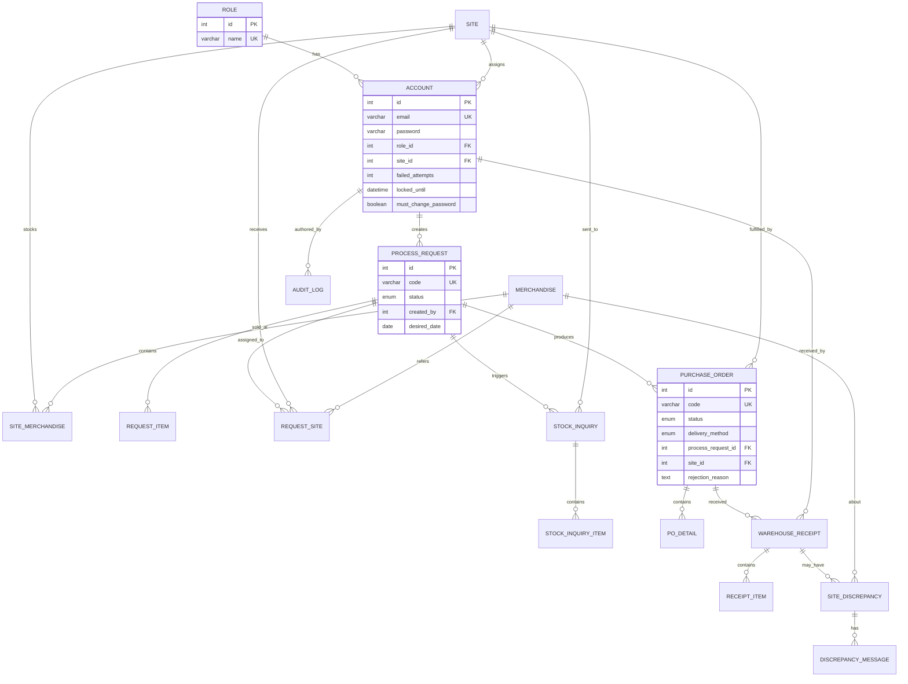

**Ghi chú thiết kế:**

- Các bảng `*_ITEM`, `*_DETAIL`, `REQUEST_SITE` là junction tables (many-to-many) — tách bảng riêng vì cần lưu thêm thuộc tính (quantity, price, status...).
- `PROCESS_REQUEST` → `PURCHASE_ORDER`: quan hệ 1-N vì 1 request có thể split thành nhiều PO (mỗi PO cho 1 site).
- `SITE_DISCREPANCY` và `DISCREPANCY_MESSAGE`: tách bảng để lưu lịch sử trao đổi giữa Warehouse và Site khi có sai lệch số lượng/chất lượng.

---

## 2. State Diagram — PurchaseOrder lifecycle (Pattern: State)

Vòng đời của một Purchase Order. Đặc biệt chú ý transition `REJECTED → DRAFT` qua `reset()` — đây là yêu cầu bug-fix v1.1.0 (giữ lại `rejectionReason` để Overseas biết lý do bị từ chối trước đó).

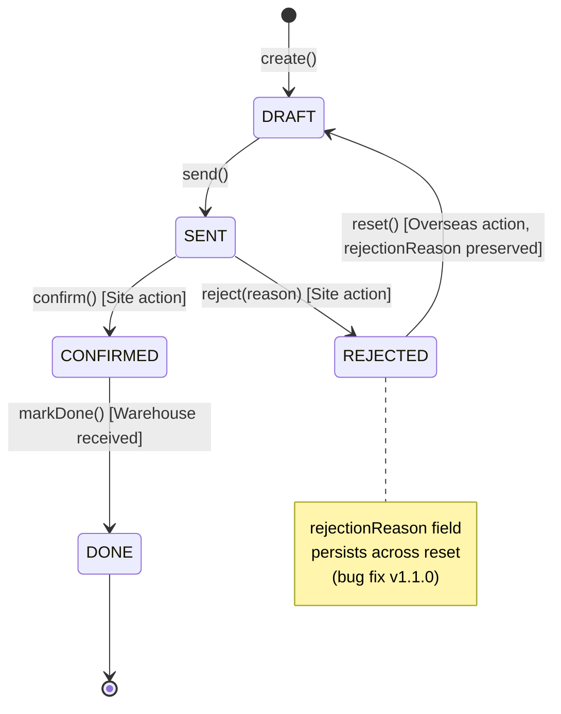

**Triển khai State pattern**: mỗi state là một class implement interface `POState` với các method `send()`, `confirm()`, `reject(reason)`, `reset()`, `markDone()`. Chi tiết xem [[analysis/academic-design-patterns]] Pattern 2.

State class chính thay vì primitive (`po.setStatus(...)`) sẽ giữ reference đến `POState` qua `POStateRegistry` (singleton map từ `POStatus` enum sang state instance) — tránh tạo mới object mỗi lần gọi.

---

## 3. State Diagram — ProcessRequest lifecycle

Vòng đời của 1 yêu cầu xử lý từ Sales gửi lên đến khi hoàn tất.

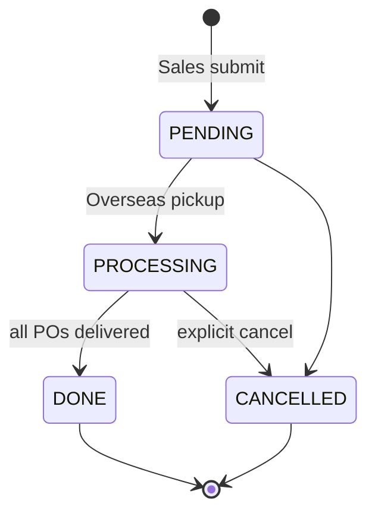

**Ghi chú nghiệp vụ:**
- `PENDING → PROCESSING`: Overseas mở yêu cầu để xử lý (B1 của UC6).
- `PROCESSING → DONE`: tự động khi tất cả PO con đã ở trạng thái `DONE` (có event listener trigger).
- `CANCELLED`: chỉ cho phép từ `PENDING` hoặc `PROCESSING` khi chưa có PO nào `CONFIRMED`.

---

## 4. State Diagram — StockInquiry lifecycle

Vòng đời của 1 lần Overseas hỏi tồn kho từ Site. Có cơ chế timeout 48h qua scheduler.

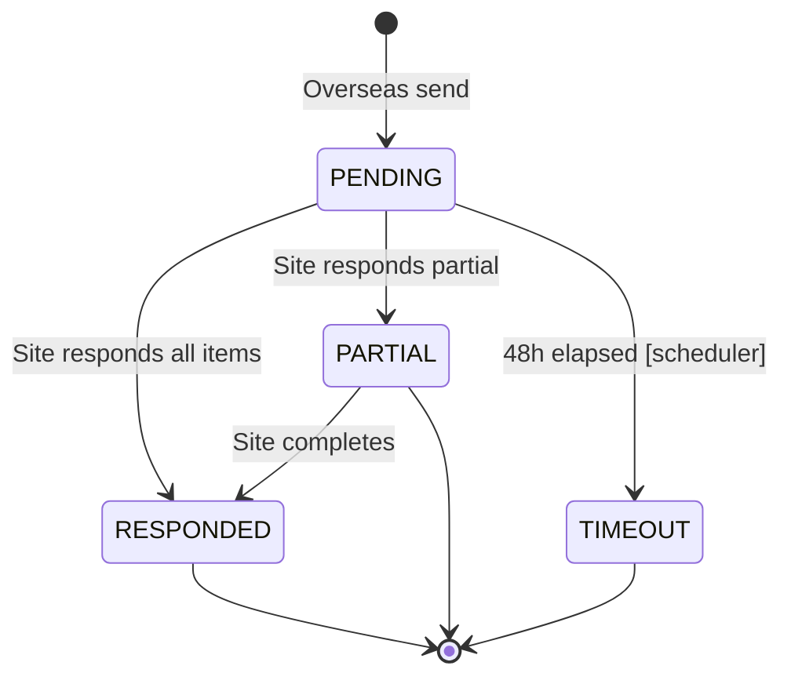

**Ghi chú:**
- `PARTIAL`: Site trả lời được vài item, còn lại để trống — vẫn đếm là đã phản hồi 1 phần.
- `TIMEOUT`: scheduler `@Scheduled(fixedRate=300000)` chạy mỗi 5 phút quét các inquiry quá 48h — chuyển sang TIMEOUT và publish `InquiryTimeoutEvent`.

---

## 5. Sequence Diagram — UC11 PO Confirm Flow (Pattern: Observer/Domain Events)

Luồng khi Site bấm "Confirm PO". Minh họa pattern Observer qua Spring `ApplicationEventPublisher` + `@TransactionalEventListener(AFTER_COMMIT)`.

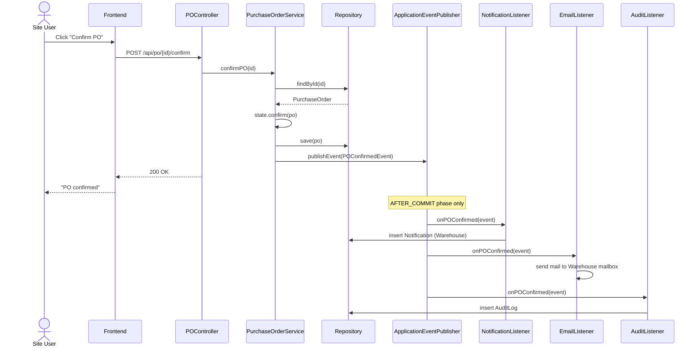

**Điểm chốt:**
- Tất cả 3 listener (`Notif`, `Email`, `Audit`) đều dùng `@TransactionalEventListener(phase = AFTER_COMMIT)` — nếu transaction rollback thì không bị side-effect (không gửi email nhầm, không log audit sai).
- Service KHÔNG gọi trực tiếp `notificationService.create()` + `emailService.send()` + `auditLogService.log()` nữa (giải SRP) — chỉ publish event.
- Thêm listener mới (vd: WebhookListener) chỉ cần annotate `@EventListener` — không sửa `PurchaseOrderService`.

---

## 6. Sequence Diagram — UC7 Stock Inquiry Timeout (Scheduler)

Scheduler tự động quét các inquiry quá hạn và chuyển sang TIMEOUT.

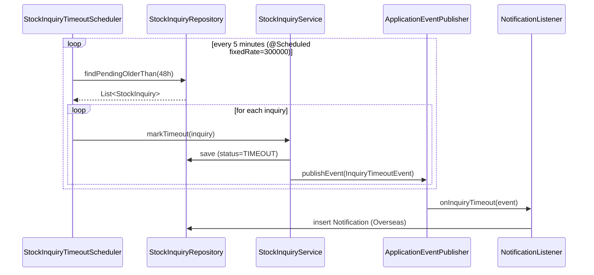

**Ghi chú:**
- Scheduler nằm trong package `*.scheduler` riêng — không trộn lẫn với business service.
- Method `markTimeout()` được annotate `@Transactional` riêng để mỗi inquiry là 1 transaction nhỏ (nếu 1 cái lỗi, các cái khác vẫn xử lý được).

---

## 7. Class Diagram — Backend bounded contexts (4 contexts)

Bounded contexts sau khi gom (xem [[analysis/academic-target-architecture]]). Giảm từ 7 contexts (đề xuất ban đầu over-DDD) xuống 4 contexts phù hợp với quy mô ~5000-7000 LOC.

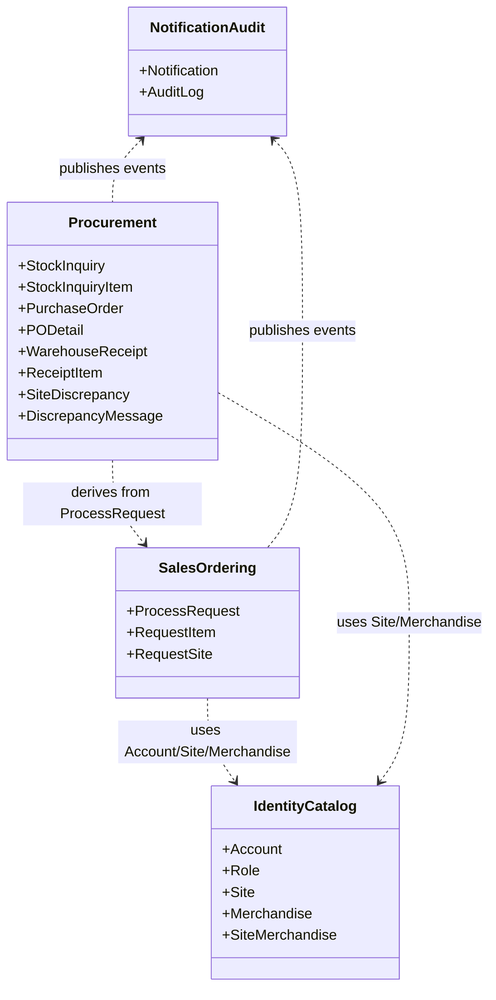

**Lý do gom 4 contexts:**
1. **IdentityCatalog**: nhóm dữ liệu master (Account, Role, Site, Merchandise) — ít biến động, dùng chung khắp nơi.
2. **SalesOrdering**: vòng đời yêu cầu từ Sales — domain rõ ràng, 3 entity gắn chặt.
3. **Procurement**: nhóm toàn bộ luồng mua hàng (inquiry → PO → receipt → discrepancy) — chung lifecycle, chung actor Site/Warehouse.
4. **NotificationAudit**: cross-cutting concern — nhận event từ mọi context.

Phụ thuộc luôn theo 1 chiều (downstream depend on upstream): NotificationAudit phụ thuộc các context nghiệp vụ, không ngược lại.

---

## 8. Class Diagram — PO State Pattern detail

Chi tiết cài đặt State pattern cho PurchaseOrder (đối lập với cách primitive `setStatus(...)` cũ).

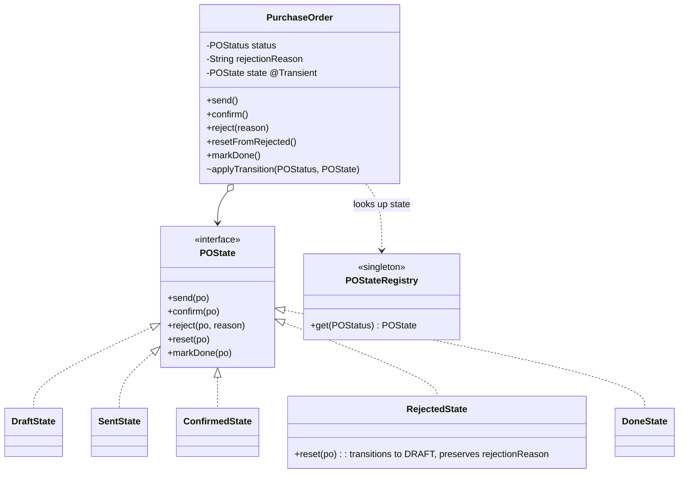

**Điểm chốt cài đặt:**
- `POStateRegistry` là singleton `Map<POStatus, POState>` được khởi tạo 1 lần lúc startup — KHÔNG tạo new instance mỗi lần gọi (tránh GC noise).
- Field `state` annotate `@Transient` (JPA không persist) — được rehydrate qua `@PostLoad` hook từ `status` enum đã load.
- Method `applyTransition(newStatus, newState)` package-private — chỉ State class gọi được, đảm bảo đúng đường biến đổi.

---

## 9. Component Diagram — Frontend after refactor (P4-P5)

Cấu trúc Frontend sau khi refactor xong (giai đoạn P4-P5 trong [[analysis/academic-refactor-plan]]). Mục tiêu: page mỏng (~30 dòng), logic gom vào features + hooks.

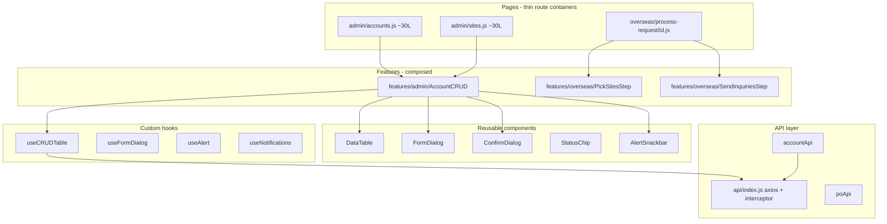

**Layer khô:**
1. **Pages**: chỉ là route handler, mount feature component, không chứa logic.
2. **Features**: tổ hợp primitives + hooks, biết về domain (Account, PO...).
3. **Primitives**: reusable, không biết domain.
4. **Hooks**: state + side-effect logic, không render UI.
5. **API**: axios + interceptor (auth, refresh token, error toast).

---

## 10. Use Case Diagram (giản lược, 5 actors)

Tổng quan các use case chính theo actor. Đầy đủ hơn xem [[features/]] và spec.

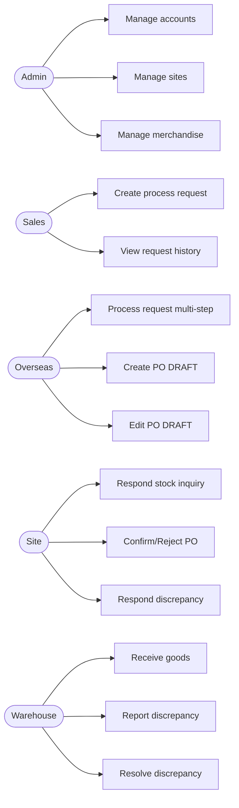

**Ghi chú:**
- Mỗi actor map 1-1 với 1 Role trong DB (`ROLE` table).
- UC6 (Overseas multi-step) là use case phức tạp nhất — chi tiết xem activity diagram bên dưới.
- Mũi tên đi từ actor sang use case (UML notation chuẩn).

---

## 11. Activity Diagram — Overseas 5-step Process Request (UC6)

Luồng nghiệp vụ phức tạp nhất: Overseas xử lý 1 request từ Sales qua 5 bước.

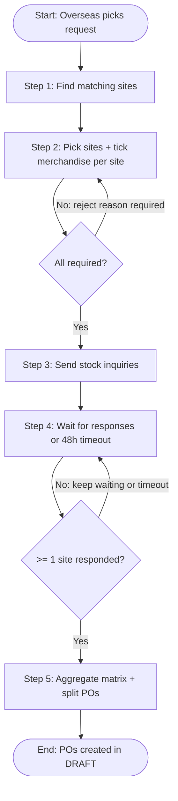

**Ghi chú từng bước:**
- **S1**: query `SiteMerchandise` để tìm site có bán đủ các merchandise yêu cầu.
- **S2**: Overseas chọn site cụ thể + tick từng item — có thể không tick hết nếu site không có đủ.
- **D1**: nếu tổng item đã tick < tổng item request → bắt buộc nhập lý do (audit lưu lại).
- **S3-S4**: tạo `StockInquiry` cho từng site, scheduler đếm thời gian.
- **S5**: gom ma trận response, mỗi site → 1 PO DRAFT, Overseas xem lại trước khi `send()`.

---

## 12. Mapping diagram - file/page coverage

Bảng map diagram ↔ file code ↔ use case — giúp giáo viên trace từ diagram về source code khi chấm.

| Diagram # | Diagram name | Use case | Backend file | Frontend file |
|-----------|--------------|----------|--------------|---------------|
| 1 | ER schema | All | `*/entity/*.java` (18 files) | — |
| 2 | PO state | UC11-13 | `entity/PurchaseOrder.java`, `service/state/*State.java` | `pages/site/po/[id].js` |
| 3 | ProcessRequest state | UC4, UC6 | `entity/ProcessRequest.java` | `pages/sales/request/[id].js` |
| 4 | StockInquiry state | UC7 | `entity/StockInquiry.java`, `scheduler/StockInquiryTimeoutScheduler.java` | `pages/site/inquiry/[id].js` |
| 5 | PO confirm sequence | UC13 | `service/PurchaseOrderService.java`, `listener/PO*Listener.java` | `pages/site/po/[id].js` |
| 6 | Inquiry timeout sequence | UC7 | `scheduler/StockInquiryTimeoutScheduler.java` | — |
| 7 | Bounded contexts | All | package layout `*/identity`, `*/sales`, `*/procurement`, `*/notification` | `src/features/{admin,sales,overseas,site,warehouse}` |
| 8 | PO state class | UC11-13 | `service/state/PO*State.java`, `POStateRegistry.java` | — |
| 9 | Frontend component | UC1-3 | — | `src/{pages,features,components,hooks,api}` |
| 10 | Use case | All | `controller/*Controller.java` (13 files) | `pages/*` (per role) |
| 11 | Overseas activity | UC6 | `service/ProcessRequestService.java` | `pages/overseas/process-request/[id].js` |

---

## 13. Notes for thuyết trình (presentation)

Gợi ý chuẩn bị cho buổi bảo vệ:

- **Export PNG cho slide**: vào [mermaid.live](https://mermaid.live), paste code → Download PNG (chọn resolution 2x cho slide rõ).
- **Reference page**: chèn footer slide kèm số diagram (vd "Diagram 5 — PO Confirm Flow") để dễ ref lúc thầy hỏi.
- **Before/after class diagram**: nên trình 2 slide:
  - Slide A: kiến trúc cũ (Layered, Service class to ~500 dòng, gọi 4 service khác).
  - Slide B: kiến trúc mới (bounded contexts + Observer + State + Strategy).
- **Demo flow**:
  1. ER diagram (5 phút) — giới thiệu schema.
  2. State diagram PO (5 phút) — nhấn mạnh REJECTED → DRAFT bug-fix.
  3. Sequence diagram UC11 (10 phút) — vừa show code vừa point sang diagram.
  4. Class diagram bounded contexts (5 phút) — kết luận thiết kế.
- **Print backup**: in 1 bản A3 ER diagram + state diagram PO mang theo phòng dự phòng máy chiếu lỗi.

---

## 14. Related + Backlinks

- [[analysis/academic-code-review]] — phân tích code hiện tại (SOLID violations, smell)
- [[analysis/academic-target-architecture]] — kiến trúc đích sau refactor
- [[analysis/academic-design-patterns]] — chi tiết 5 design patterns sẽ áp dụng
- [[analysis/academic-refactor-plan]] — kế hoạch refactor theo phase
- [[data/schema-overview]] — schema chi tiết tất cả 18 tables + cột
- [[components/backend-architecture]] — kiến trúc Backend (package, layer)
- [[components/frontend-architecture]] — kiến trúc Frontend (page, hook, api)
- [[overview]] — entry point của wiki
