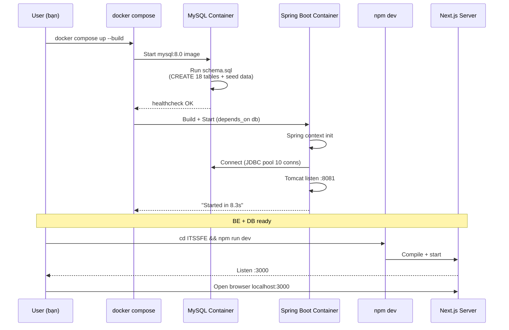
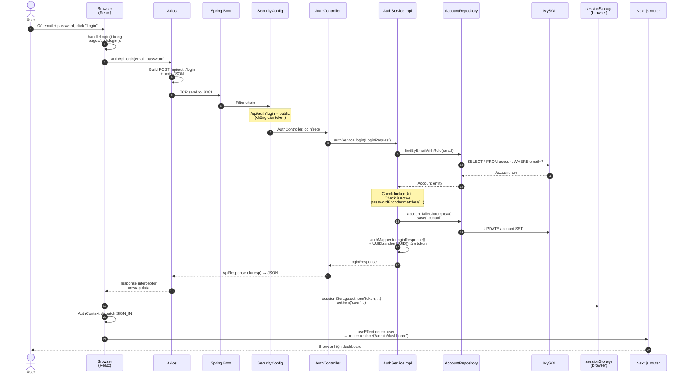
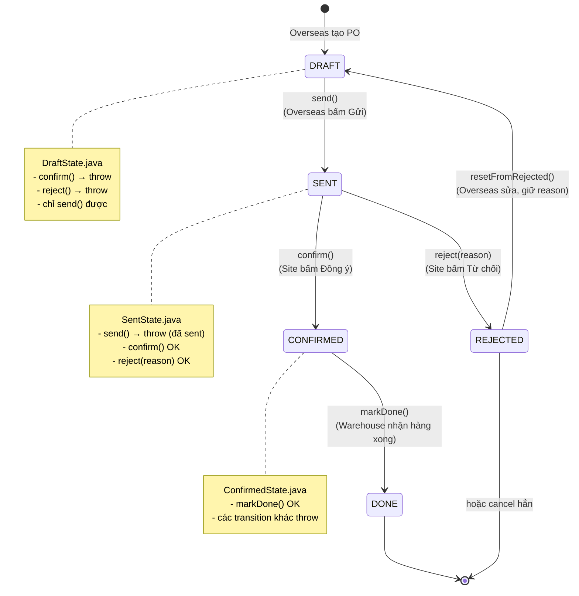
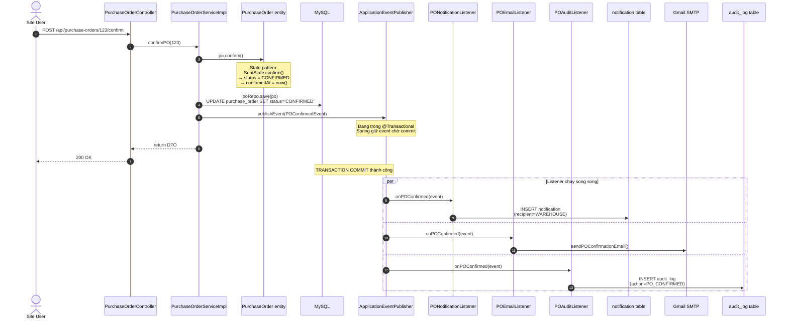
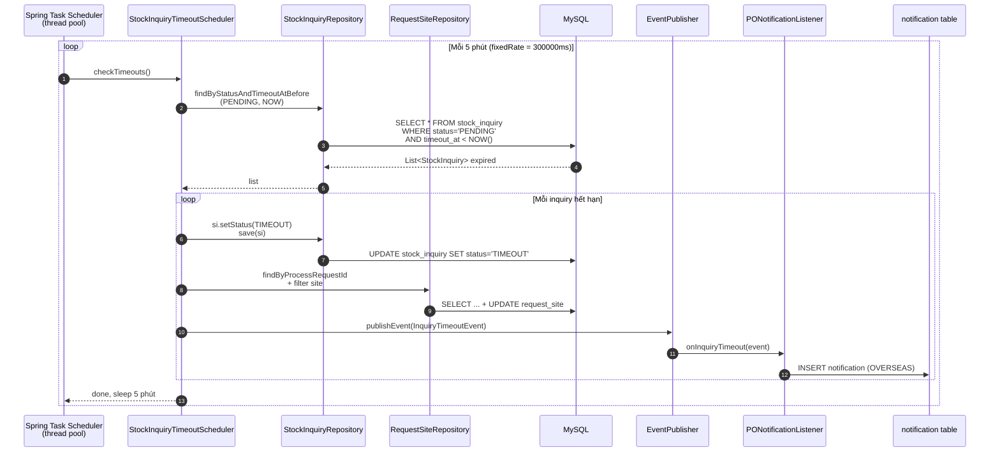
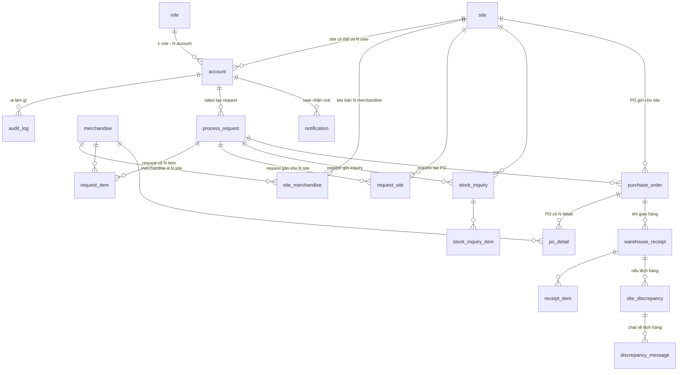

# Hệ Thống Chạy Như Thế Nào — Sơ Đồ Từng Bước

> **File này thay thế lời giải thích bằng SƠ ĐỒ THẬT**. Mở GitHub xem inline cũng được — Mermaid auto render. Mọi sơ đồ đều trỏ vào file code thật trong repo.
>
> Đọc tuần tự. Mỗi mục đều có dạng: **(1) Sơ đồ → (2) Walkthrough từng bước → (3) Code thật ở đâu**.

---

## MỤC LỤC

1. [Toàn cảnh — 3 process đang chạy gì](#1-toàn-cảnh)
2. [Khởi động hệ thống — `docker compose up` rồi thì sao](#2-khởi-động-hệ-thống)
3. [1 request HTTP đầy đủ — bytes trên dây thật](#3-1-request-http-đầy-đủ)
4. [LOGIN — 18 bước từ click button đến vào dashboard](#4-flow-login-đầy-đủ)
5. [State Machine PurchaseOrder — DRAFT → DONE](#5-state-machine-purchaseorder)
6. [Observer Pattern — 1 event nổ ra 3 listener cùng chạy](#6-observer-pattern-thực-tế)
7. [Scheduler — cron job 5 phút 1 lần](#7-scheduler-cron-5-phút)
8. [Frontend Component Tree — DOM ngay lúc bạn ở `/admin/accounts`](#8-frontend-component-tree)
9. [Database — 18 bảng nối nhau ra sao](#9-database-18-bảng)
10. [Khi bug — nhìn log ở đâu, debug như thế nào](#10-debug-flow)

---

## 1. Toàn Cảnh

### Khi project đang chạy, có **3 process** trên máy bạn:

```
┌──────────────────────────────────────────────────────────────────────────────┐
│                              MÁY TÍNH CỦA BẠN                                │
│                                                                              │
│   ┌────────────────────┐    ┌──────────────────────┐    ┌────────────────┐   │
│   │  Chrome / Firefox  │    │  Java JVM            │    │  MySQL daemon  │   │
│   │  (Process 1)       │    │  (Process 2)         │    │  (Process 3)   │   │
│   │                    │    │                      │    │                │   │
│   │  Next.js dev       │    │  Spring Boot app     │    │  Đang giữ file │   │
│   │  server +          │    │  - Tomcat embedded   │    │  database trên │   │
│   │  React app load    │    │  - Hibernate ORM     │    │  ổ cứng        │   │
│   │  trong browser tab │    │  - Spring context    │    │                │   │
│   │                    │    │                      │    │  18 bảng SQL   │   │
│   │  RAM ~50-100MB     │    │  RAM ~300-500MB      │    │  RAM ~150MB    │   │
│   │                    │    │                      │    │                │   │
│   │  LẮNG NGHE :3000   │    │  LẮNG NGHE :8081     │    │  LẮNG NGHE     │   │
│   │                    │    │                      │    │  :3307         │   │
│   └─────────┬──────────┘    └──────────┬───────────┘    └────────┬───────┘   │
│             │                          │                         │           │
│             │   HTTP/JSON              │   JDBC (TCP+SQL)        │           │
│             │   (port 3000→8081)       │   (port 8081→3307)      │           │
│             │                          │                         │           │
│             └─────────► API calls ─────┴─────► SQL queries ──────┘           │
│                                                                              │
└──────────────────────────────────────────────────────────────────────────────┘
```

### Mỗi process làm gì cụ thể?

```
┌─────────────────────────────────────────────────────────────────────────┐
│ PROCESS 1: BROWSER (Chrome)                                             │
├─────────────────────────────────────────────────────────────────────────┤
│ • Mở tab http://localhost:3000                                          │
│ • Tải HTML + JS bundle từ Next.js dev server                            │
│ • Chạy React app: vẽ UI, lắng nghe click, gọi API qua axios             │
│ • Lưu token vào sessionStorage                                          │
│                                                                         │
│ → Bạn thấy được: UI hiển thị trong tab browser                          │
└─────────────────────────────────────────────────────────────────────────┘

┌─────────────────────────────────────────────────────────────────────────┐
│ PROCESS 2: SPRING BOOT (Java)                                           │
├─────────────────────────────────────────────────────────────────────────┤
│ • Khởi động bằng `mvn spring-boot:run`                                  │
│ • Tomcat embedded mở socket TCP port 8081, lắng nghe HTTP request       │
│ • Spring IoC container giữ ~50 bean singleton (controller/service/...)  │
│ • Hibernate có connection pool ~10 connection đến MySQL                 │
│ • Scheduler thread: cứ 5 phút check inquiry timeout                     │
│                                                                         │
│ → Bạn thấy được: log "Started ImportOrderApplication" trong terminal    │
└─────────────────────────────────────────────────────────────────────────┘

┌─────────────────────────────────────────────────────────────────────────┐
│ PROCESS 3: MYSQL                                                        │
├─────────────────────────────────────────────────────────────────────────┤
│ • Daemon `mysqld` chạy nền                                              │
│ • Giữ data file của DB `import_order_system` trên ổ cứng                │
│ • Listen port 3307 (mặc định 3306, đổi vì port bị chiếm)                │
│ • Buffer pool ~128MB cache hot rows trong RAM                           │
│                                                                         │
│ → Bạn thấy được: kết nối được bằng MySQL Workbench / DBeaver            │
└─────────────────────────────────────────────────────────────────────────┘
```

### Tương đương Unity:
| Process này | Trong Unity bạn quen |
|---|---|
| Browser (Chrome) | Game client `.exe` |
| Spring Boot | Dedicated server (như Mirror/Photon server) |
| MySQL | File save trên Google Drive (persistent, multi-client) |

**Khác biệt mấu chốt**: trong Unity bạn build 1 exe chạy mọi thứ. Ở đây 3 process tách biệt, mỗi cái có thể crash riêng, restart riêng, deploy lên 3 máy khác nhau.

---

## 2. Khởi Động Hệ Thống

### Bạn gõ `docker compose up --build` → đây là thứ thực sự xảy ra:

```
THỜI GIAN ─────────────────────────────────────────────────────────────►

t=0s   docker compose đọc docker-compose.yml
       ┌───────────────────────────────────────┐
       │ Tìm thấy 2 service: db, backend       │
       │ Phụ thuộc: backend depends_on db      │
       └───────────────────────────────────────┘

t=1s   ┌─────────────────────────────┐
       │ KHỞI ĐỘNG db trước          │
       │ • Pull image mysql:8.0      │
       │ • Mount SQL/schema.sql vào  │
       │   /docker-entrypoint-initdb │
       │ • Start mysqld process      │
       └─────────────────────────────┘

t=5s   ┌─────────────────────────────┐
       │ mysqld bắt đầu init         │
       │ • Tạo DB import_order_system│
       │ • Chạy schema.sql:          │
       │   CREATE TABLE account...   │
       │   CREATE TABLE site...      │
       │   ... (18 bảng)             │
       │   INSERT default users      │
       │ • Mở port 3306 (container)  │
       │   → 3307 (host)             │
       └─────────────────────────────┘

t=15s  ┌─────────────────────────────┐
       │ Healthcheck pass:           │
       │   mysqladmin ping = OK      │
       │ → db service READY          │
       └─────────────────────────────┘

t=16s  ┌─────────────────────────────┐
       │ KHỞI ĐỘNG backend           │
       │ • Build Dockerfile:         │
       │   - mvn package → jar       │
       │ • Run java -jar app.jar     │
       └─────────────────────────────┘

t=25s  ┌──────────────────────────────────────────────────────┐
       │ Spring Boot init sequence:                           │
       │                                                      │
       │ 1. Đọc application.properties                        │
       │ 2. Connect MySQL → tạo connection pool (HikariCP)    │
       │ 3. Hibernate scan @Entity → so sánh với DB schema    │
       │    (ddl-auto=update → auto thêm column thiếu)        │
       │ 4. Spring IoC scan @Component/@Service/@Repository:  │
       │    → tạo singleton bean cho mỗi class                │
       │    → inject dependency vào constructor               │
       │ 5. PasswordMigrationRunner chạy (config/)            │
       │    → check user nào password chưa hash → hash BCrypt │
       │ 6. Scheduler bean register cron task                 │
       │ 7. Tomcat embedded mở socket :8081                   │
       │                                                      │
       │ → Log "Started ImportOrderApplication in 8.3 sec"    │
       └──────────────────────────────────────────────────────┘

t=30s  HỆ THỐNG SẴN SÀNG (DB + BE)
       Bạn vẫn cần chạy FE riêng: cd ITSSFE && npm run dev

t=35s  ┌─────────────────────────────┐
       │ Next.js dev server:         │
       │ • Compile src/ thành JS     │
       │ • Mở socket :3000           │
       │ • Watch file để hot-reload  │
       └─────────────────────────────┘

t=40s  Tất cả 3 process ready.
       Bạn mở http://localhost:3000 → login!
```

### Sơ đồ phụ thuộc khởi động:



---

## 3. 1 Request HTTP Đầy Đủ

### Khi FE gọi `axios.get('/api/accounts')` → đây là bytes thật trên TCP:

```
┌─────────────── BROWSER GỬI ĐI ────────────────┐
│                                                │
│  GET /api/accounts HTTP/1.1       ←  Method + URL + version
│  Host: localhost:8081             ←  Server đích
│  Authorization: Bearer abc123...  ←  Token (set bởi axios interceptor)
│  Content-Type: application/json
│  Origin: http://localhost:3000    ←  Browser tự thêm
│  Accept: */*
│                                   ←  Dòng trống = hết header
│  (không có body cho GET)          ←  GET không có body
│                                                │
└────────────────────────────────────────────────┘
                    │
                    │  TCP packet
                    ▼
┌─────────────── BE NHẬN VÀ XỬ LÝ ──────────────────────────┐
│                                                            │
│  Tomcat thread pool nhận socket                            │
│       │                                                    │
│       ▼                                                    │
│  Spring DispatcherServlet route request                    │
│       │                                                    │
│       ▼                                                    │
│  SecurityConfig filter chain:                              │
│  - check path: /api/accounts                               │
│  - require auth → check header Authorization               │
│  - parse token "abc123..." → lookup user                   │
│  - inject SecurityContext (current user)                   │
│       │                                                    │
│       ▼                                                    │
│  Match @GetMapping → AccountController.getAll()            │
│       │                                                    │
│       ▼                                                    │
│  Controller gọi accountService.getAll()                    │
│       │                                                    │
│       ▼                                                    │
│  Service gọi accountRepository.findAll()                   │
│       │                                                    │
│       ▼                                                    │
│  JPA sinh SQL: SELECT * FROM account                       │
│       │                                                    │
│       ▼                                                    │
│  Gửi SQL qua JDBC socket :3307 → MySQL                     │
│                                                            │
└────────────────────────────────────────────────────────────┘
                    │
                    ▼
┌─────────────── MYSQL TRẢ ROW ─────────────────────────────┐
│  SELECT engine đọc bảng account → trả N rows               │
│  → mỗi row JDBC parse thành Account entity                 │
└────────────────────────────────────────────────────────────┘
                    │
                    ▼
┌─────────────── BE TRẢ JSON ───────────────────────────────┐
│  Service map List<Account> → List<AccountDTO> (MapStruct)  │
│  Controller wrap vào ApiResponse                           │
│  Spring Jackson serialize → JSON                           │
│                                                            │
│  HTTP/1.1 200 OK                                           │
│  Content-Type: application/json                            │
│  Access-Control-Allow-Origin: *                            │
│                                                            │
│  {"success":true,"data":[{"id":1,"email":"admin@..."},...]}│
└────────────────────────────────────────────────────────────┘
                    │
                    │  TCP packet
                    ▼
┌─────────────── BROWSER NHẬN ──────────────────────────────┐
│  Axios response interceptor:                               │
│  - check ApiResponse shape → unwrap data                   │
│  - trả về [{id:1,...}, ...] cho code FE                    │
│                                                            │
│  React component re-render với data mới                    │
│  → DataTable hiện list account                             │
└────────────────────────────────────────────────────────────┘

  ⏱️ Toàn bộ flow: ~30-100ms (localhost), ~200-500ms (qua internet)
```

### Tương đương Unity:

Y hệt `UnityWebRequest.Get(url)`:
- Bạn build request (URL + header)
- Yield/await response
- Parse JSON ra `class`
- Update UI

Chỉ khác: Unity bạn gọi tới server xa, đây gọi vào `localhost`.

---

## 4. Flow Login Đầy Đủ

### 18 bước từ lúc bạn ấn nút "Login" đến lúc thấy dashboard



### Trỏ vào code thật:

| Bước | File | Dòng |
|---|---|---|
| 1-2 | [ITSSFE/src/pages/auth/login.js](ITSSFE/src/pages/auth/login.js) | `handleLogin` (line 24-33) |
| 3 | [ITSSFE/src/api/index.js](ITSSFE/src/api/index.js) | `authApi.login` (line 69) |
| 4-5 | axios internal | — |
| 6-7 | [ITSSBE/.../config/SecurityConfig.java](ITSSBE/src/main/java/com/example/importorder/config/SecurityConfig.java) | filter chain |
| 8 | [ITSSBE/.../controller/AuthController.java](ITSSBE/src/main/java/com/example/importorder/controller/AuthController.java) | line 16-19 |
| 9 | [ITSSBE/.../service/impl/AuthServiceImpl.java](ITSSBE/src/main/java/com/example/importorder/service/impl/AuthServiceImpl.java) | `login()` line 32 |
| 10-12 | Same file, line 34 | `findByEmailWithRole` |
| 13-15 | Same file, line 38-55 | lockout + bcrypt check |
| 16-18 | Same file, line 57-64 | reset attempts, gen token |
| 19-20 | [api/index.js](ITSSFE/src/api/index.js) | interceptor line 13-21 |
| 21 | [contexts/auth-context.js](ITSSFE/src/contexts/auth-context.js) | `signIn` |
| 22-23 | [pages/auth/login.js](ITSSFE/src/pages/auth/login.js) | useEffect line 17-22 |

### Cái gì xảy ra trong RAM ở từng bước:

```
TRƯỚC LOGIN:
┌────────────────────────────────────────────────────────────────┐
│ BROWSER tab RAM:                                               │
│ - React tree: <App><AuthProvider state={user:null}>...         │
│ - sessionStorage: {} (rỗng)                                    │
│                                                                │
│ BE JVM heap:                                                   │
│ - Spring container giữ ~50 bean singleton                      │
│ - HikariCP pool: 10 connection sẵn sàng                        │
│ - KHÔNG có user session (stateless!)                           │
│                                                                │
│ MYSQL:                                                         │
│ - Bảng account có row {id:1, email:admin, password:bcrypt_hash}│
└────────────────────────────────────────────────────────────────┘

SAU LOGIN:
┌────────────────────────────────────────────────────────────────┐
│ BROWSER tab RAM:                                               │
│ - React tree re-render: <AuthProvider state={user:{...}}       │
│ - sessionStorage: {token: "abc", user: "{...}"}                │
│                                                                │
│ BE JVM heap:                                                   │
│ - VẪN không có session — stateless                             │
│ - Token "abc" KHÔNG lưu ở BE                                   │
│ - Mỗi request sau đó FE phải gửi kèm token để BE verify        │
│                                                                │
│ MYSQL:                                                         │
│ - account.failed_attempts = 0 (reset)                          │
│ - account.locked_until = NULL                                  │
└────────────────────────────────────────────────────────────────┘
```

⚠️ **Quan trọng**: BE **stateless**. Đóng tab → mở tab mới → FE vẫn còn token trong sessionStorage → gửi request kèm token → BE verify lại. Khác hẳn Unity có `static GameManager.Instance.CurrentPlayer` giữ trong RAM mãi.

---

## 5. State Machine PurchaseOrder

### Đời 1 PurchaseOrder từ tạo đến hoàn tất:



### Cấu trúc class State Pattern:

```
                    ┌──────────────────────────┐
                    │  interface POState       │
                    │  ─────────────────────   │
                    │  + send(po)              │
                    │  + confirm(po)           │
                    │  + reject(po, reason)    │
                    │  + resetFromRejected(po) │
                    │  + markDone(po)          │
                    └────────────┬─────────────┘
                                 │ implements
        ┌───────────┬────────────┼────────────┬───────────┐
        ▼           ▼            ▼            ▼           ▼
  ┌──────────┐ ┌──────────┐ ┌─────────────┐ ┌──────────┐ ┌─────────┐
  │DraftState│ │SentState │ │ConfirmedSt..│ │RejectedSt│ │DoneState│
  └──────────┘ └──────────┘ └─────────────┘ └──────────┘ └─────────┘
        ▲           ▲            ▲            ▲           ▲
        │           │            │            │           │
        │           │  ┌─────────┴────────────┘           │
        │           │  │                                  │
        │  ┌────────┴──┴──────────────┐                   │
        │  │  POStateRegistry          │  ← static singleton
        │  │  ──────────────────────   │     Map<POStatus,POState>
        │  │  Map: DRAFT  → DraftState │
        │  │       SENT   → SentState  │
        │  │       ...                 │
        │  └──────────────┬────────────┘
        │                 │ lookup
        │                 │
        │     ┌───────────▼──────────────┐
        │     │  PurchaseOrder entity    │
        │     │  ────────────────────    │
        │     │  status: POStatus enum   │  ← lưu xuống DB
        │     │  @Transient state: POState│  ← runtime only
        │     │                          │
        │     │  send()    {state.send(this);}    ← delegate đến state
        │     │  confirm() {state.confirm(this);}
        │     │  ...                     │
        │     └──────────────────────────┘
        │                ▲
        │                │ @PostLoad
        └────────────────┘ khi load từ DB,
                           inject state từ Registry
```

### Tại sao dùng State Pattern thay vì `if/else`?

**Cách không State Pattern (rối):**
```java
public void confirmPO(Integer id) {
    PurchaseOrder po = repo.findById(id);
    if (po.getStatus() == DRAFT) throw new Exception("Must send first");
    if (po.getStatus() == REJECTED) throw new Exception("Already rejected");
    if (po.getStatus() == CONFIRMED) throw new Exception("Already confirmed");
    if (po.getStatus() == DONE) throw new Exception("Already done");
    if (po.getStatus() == SENT) {
        po.setStatus(CONFIRMED);
        po.setConfirmedAt(now());
        repo.save(po);
    }
}
// Mỗi method (send/reject/markDone) đều phải copy paste 5 if này → DUPLICATE
```

**Cách dùng State Pattern (sạch):**
```java
public void confirmPO(Integer id) {
    PurchaseOrder po = repo.findById(id);
    po.confirm();  // ← state tự throw nếu sai status
    repo.save(po);
}
// SentState.confirm()    → OK, transition
// DraftState.confirm()   → throw
// RejectedState.confirm() → throw
// ...
```

**Unity analogy**: Như `Animator.SetTrigger("Confirm")`. Nếu state hiện tại không có transition "Confirm" → Animator bỏ qua / throw. Bạn không phải viết switch case kiểm tra "đang state nào, có cho phép Confirm không".

📁 Code: [ITSSBE/.../domain/po/state/](ITSSBE/src/main/java/com/example/importorder/domain/po/state/)

---

## 6. Observer Pattern Thực Tế

### Khi Site bấm "Confirm PO" → 3 listener CÙNG chạy độc lập



### Vì sao `@TransactionalEventListener(AFTER_COMMIT)` quan trọng?

```
KỊCH BẢN 1 — Không dùng AFTER_COMMIT (BUG):
─────────────────────────────────────────────
1. Service: po.setStatus(CONFIRMED)
2. Service: publishEvent(POConfirmedEvent)
3. Listener CHẠY NGAY: gửi email "PO confirmed!"
4. Service: poRepo.save(po) ← LỖI database, rollback
5. DB rollback: status vẫn là SENT

→ User nhận email "PO confirmed" nhưng DB không có gì.
  Site mở web thấy PO vẫn SENT. Lú.

KỊCH BẢN 2 — Dùng AFTER_COMMIT (đúng):
─────────────────────────────────────────────
1. Service: po.setStatus(CONFIRMED)
2. Service: publishEvent → Spring GIỮ EVENT trong queue
3. Service: poRepo.save(po) ← LỖI, rollback
4. Spring DROP event (không fire)

→ Không có email, không có audit. State giữ nhất quán.

KỊCH BẢN 3 — AFTER_COMMIT khi happy path:
─────────────────────────────────────────────
1. Service: po.setStatus(CONFIRMED)
2. Service: publishEvent → Spring giữ event
3. Service: poRepo.save(po) ← OK
4. @Transactional method return → Spring COMMIT
5. AFTER_COMMIT → Spring fire event đến 3 listener
6. 3 listener chạy: notification + email + audit log
```

### Tương đương Unity:

```csharp
// Unity UnityEvent fire ngay lập tức (không có "AFTER_COMMIT"):
public UnityEvent OnPOConfirmed;

void ConfirmPO() {
    po.status = CONFIRMED;
    OnPOConfirmed.Invoke();  // fire NGAY
    SavePO(po);  // nếu save lỗi → đã invoke rồi, không revert được
}

// → trong Unity bạn phải tự handle race condition.
// → Spring làm sẵn cho bạn qua AFTER_COMMIT.
```

📁 Code:
- Publish: [PurchaseOrderServiceImpl.java line 148-160](ITSSBE/src/main/java/com/example/importorder/service/impl/PurchaseOrderServiceImpl.java)
- Listener 1: [PONotificationListener.java](ITSSBE/src/main/java/com/example/importorder/listener/PONotificationListener.java)
- Listener 2: [POEmailListener.java](ITSSBE/src/main/java/com/example/importorder/listener/POEmailListener.java)
- Listener 3: [POAuditListener.java](ITSSBE/src/main/java/com/example/importorder/listener/POAuditListener.java)
- Event class: [event/POConfirmedEvent.java](ITSSBE/src/main/java/com/example/importorder/event/POConfirmedEvent.java)

---

## 7. Scheduler Cron 5 Phút

### Cứ mỗi 5 phút, 1 thread riêng tự chạy:

```
TIMELINE (BE đang chạy):
─────────────────────────────────────────────────────────────────►
t=0          t=5min       t=10min      t=15min      t=20min
│            │            │            │            │
▼            ▼            ▼            ▼            ▼
[scheduler] [scheduler] [scheduler] [scheduler] [scheduler]
   chạy        chạy        chạy        chạy        chạy
   
Mỗi lần chạy:
┌──────────────────────────────────────────────────────────────┐
│ StockInquiryTimeoutScheduler.checkTimeouts()                 │
│                                                              │
│ 1. Query: tìm StockInquiry status=PENDING + timeoutAt<NOW    │
│    SELECT * FROM stock_inquiry                               │
│    WHERE status='PENDING' AND timeout_at < NOW()             │
│                                                              │
│ 2. For mỗi inquiry hết hạn:                                  │
│    a. Set status = TIMEOUT                                   │
│    b. Update các RequestSite liên quan → TIMEOUT             │
│    c. publishEvent(InquiryTimeoutEvent)                      │
│       → PONotificationListener tạo notification cho OVERSEAS │
│       → Overseas mở web thấy badge thông báo                 │
└──────────────────────────────────────────────────────────────┘
```

### Sequence diagram:



### Tương đương Unity:

```csharp
public class TimeoutChecker : MonoBehaviour {
    void Start() {
        InvokeRepeating(nameof(CheckTimeouts), 0f, 300f); // mỗi 5 phút
    }

    void CheckTimeouts() {
        var expired = inquiries.Where(i => i.timeoutAt < DateTime.Now);
        foreach (var i in expired) {
            i.status = Timeout;
            OnTimeout.Invoke(i);
        }
    }
}
```

Khác biệt: Unity dùng `InvokeRepeating` chạy trên Update thread. Spring dùng thread pool riêng (config `spring.task.scheduling.pool.size=2`) → không block request handler thread.

📁 Code: [StockInquiryTimeoutScheduler.java](ITSSBE/src/main/java/com/example/importorder/scheduler/StockInquiryTimeoutScheduler.java)

---

## 8. Frontend Component Tree

### Khi bạn ở URL `/admin/accounts`, đây là cây component thật:

```
<App>                                       ← pages/_app.js
└── <AuthProvider>                          ← contexts/auth-context.js
    └── <LanguageProvider>                  ← i18n/LanguageContext.js
        └── <ThemeProvider theme={MUI}>     ← @mui/material
            └── <CssBaseline />
            └── <AccountsPage>              ← pages/admin/accounts.js
                └── <ProtectedRoute>         ← components/ProtectedRoute.js
                    │ (check auth, redirect nếu chưa login)
                    └── <DashboardLayout>    ← layouts/dashboard/index.js
                        ├── <AppBar>         ← MUI: thanh trên cùng
                        │   ├── <Logo />
                        │   ├── <LangSwitcher />  ← VI/EN button
                        │   └── <UserMenu />
                        │       ├── <NotificationBell> ← Badge số noti
                        │       └── <LogoutButton>
                        │
                        ├── <Drawer>         ← MUI: sidebar trái
                        │   ├── <NavItem href="/admin/dashboard">
                        │   ├── <NavItem href="/admin/accounts">  ← active
                        │   ├── <NavItem href="/admin/sites">
                        │   ├── <NavItem href="/admin/merchandise">
                        │   └── ...
                        │
                        └── <Box>            ← content slot
                            └── <AccountsContent>
                                ├── <PageTitle>Quản lý tài khoản</>
                                ├── <Button>+ Thêm tài khoản</>
                                ├── <DataTable>            ← components/DataTable.jsx
                                │   ├── <SearchInput>
                                │   ├── <TableHeader columns={[...]}>
                                │   ├── <TableRow x N>      ← mỗi row 1 account
                                │   │   ├── <Cell>id</>
                                │   │   ├── <Cell>email</>
                                │   │   ├── <Cell>role</>
                                │   │   ├── <StatusChip>    ← components/StatusChip.jsx
                                │   │   └── <ActionButtons>
                                │   │       ├── Edit
                                │   │       ├── Lock/Unlock
                                │   │       ├── ResetPwd
                                │   │       └── Delete
                                │   └── <Pagination>
                                │
                                ├── <FormDialog>            ← components/FormDialog.jsx
                                │   │ (hiển thị khi click Add/Edit)
                                │   ├── <TextField email>
                                │   ├── <TextField name>
                                │   ├── <Select role>
                                │   └── <Button Save>
                                │
                                ├── <ConfirmDialog>         ← components/ConfirmDialog.jsx
                                │   │ (hiển thị khi click Delete)
                                │   ├── "Xác nhận xóa?"
                                │   ├── <Button Cancel>
                                │   └── <Button OK>
                                │
                                └── <AlertSnackbar>         ← components/AlertSnackbar.jsx
                                    │ (toast thông báo thành công/lỗi)
```

### State lưu ở đâu trong cây?

```
┌─────────────────────────────────────────────────────────────────┐
│ <AuthProvider>                                                  │
│   state = { user: {id, email, role}, isAuthenticated: true }    │
│   → tất cả children dùng useContext(AuthContext) đọc được      │
└─────────────────────────────────────────────────────────────────┘

┌─────────────────────────────────────────────────────────────────┐
│ <LanguageProvider>                                              │
│   state = { language: 'vi' | 'en' }                             │
│   → mọi component gọi t('key') lấy text theo language          │
└─────────────────────────────────────────────────────────────────┘

┌─────────────────────────────────────────────────────────────────┐
│ <AccountsContent>  (local state via useCRUDTable hook)          │
│   state = {                                                     │
│     items: [...],          ← list account                       │
│     loading: false,                                             │
│     selectedItem: null,    ← row đang edit                      │
│     dialogOpen: false,                                          │
│     deleteConfirmOpen: false,                                   │
│     alert: { open, severity, message }                          │
│   }                                                             │
└─────────────────────────────────────────────────────────────────┘
```

### Khi user click "Edit row #5":

```
1. Row #5 click handler:
   handleEdit(item5)
        │
        ▼
2. useCRUDTable.openEditDialog(item5):
   setSelectedItem(item5)
   setDialogOpen(true)
        │
        ▼
3. React detect state change → re-render
        │
        ▼
4. <FormDialog open={true} initialData={item5}>
   → MUI Modal hiện ra với form pre-filled
        │
        ▼
5. User sửa name, click Save
        │
        ▼
6. handleSave(formData):
   await accountApi.update(item5.id, formData)
        │
        ▼
7. accountApi.update → axios.put('/api/accounts/5', formData)
        │
        ▼
8. BE update DB, trả về account mới
        │
        ▼
9. handleSave tiếp:
   setItems(items.map(i => i.id === 5 ? newItem : i))
   setDialogOpen(false)
   setAlert({ open: true, severity: 'success', message: 'Đã cập nhật' })
        │
        ▼
10. React re-render: DataTable hiện row mới + Snackbar "Đã cập nhật"
```

### Unity analogy:

```
React component tree     ≈    GameObject hierarchy với UI Toolkit
useState                 ≈    [SerializeField] auto-trigger OnValidate
Context Provider         ≈    Singleton MonoBehaviour với event
re-render                ≈    SetDirty() + redraw inspector
```

---

## 9. Database 18 Bảng

### Sơ đồ Entity-Relationship (ER):



### Phân nhóm theo bounded context (Unity gọi là "Module"):

```
┌─────────────────────────────────────────────────────────────────────┐
│  IDENTITY + CATALOG  (5 bảng)                                       │
│  ────────────────────────────                                       │
│   • account              ← user (admin, sales, overseas, site, wh)  │
│   • role                 ← ADMIN/SALES/OVERSEAS/SITE/WAREHOUSE      │
│   • site                 ← chi nhánh (US, JP, DE)                   │
│   • merchandise          ← mặt hàng                                 │
│   • site_merchandise     ← bảng nối (site nào bán mặt hàng nào)     │
└─────────────────────────────────────────────────────────────────────┘
                              │
                              ▼
┌─────────────────────────────────────────────────────────────────────┐
│  SALES ORDERING  (3 bảng)                                           │
│  ──────────────────                                                 │
│   • process_request      ← đơn yêu cầu từ Sales                     │
│   • request_item         ← chi tiết: cần mặt hàng A x100, B x50     │
│   • request_site         ← gán request cho site nào: US, JP         │
└─────────────────────────────────────────────────────────────────────┘
                              │
                              ▼
┌─────────────────────────────────────────────────────────────────────┐
│  PROCUREMENT + RECEIVING  (8 bảng)                                  │
│  ─────────────────────────────                                      │
│   • stock_inquiry        ← Overseas hỏi tồn kho                     │
│   • stock_inquiry_item   ← hỏi từng mặt hàng                        │
│   • purchase_order (PO)  ← đơn mua chính thức                       │
│   • po_detail            ← chi tiết PO                              │
│   • warehouse_receipt    ← phiếu nhập kho                           │
│   • receipt_item         ← chi tiết phiếu nhập                      │
│   • site_discrepancy     ← lệch số lượng                            │
│   • discrepancy_message  ← chat giữa warehouse + site về lệch       │
└─────────────────────────────────────────────────────────────────────┘
                              │
                              ▼
┌─────────────────────────────────────────────────────────────────────┐
│  CROSS-CUTTING  (2 bảng)                                            │
│  ────────────────                                                   │
│   • notification         ← thông báo trong app (badge số đỏ)         │
│   • audit_log            ← log mọi action quan trọng                 │
└─────────────────────────────────────────────────────────────────────┘
```

### Mỗi bảng = 1 file Entity:

```
SQL table              ↔  Java @Entity class            ↔  Unity ScriptableObject
─────────────────────────────────────────────────────────────────────────────
account                ↔  entity/Account.java            ↔  AccountData.cs
role                   ↔  entity/Role.java               ↔  RoleData.cs
site                   ↔  entity/Site.java               ↔  SiteData.cs
merchandise            ↔  entity/Merchandise.java        ↔  MerchandiseData.cs
purchase_order         ↔  entity/PurchaseOrder.java      ↔  PurchaseOrderData.cs
... (14 bảng nữa)
```

### Quan hệ trong code Java:

```java
@Entity
@Table(name = "purchase_order")
public class PurchaseOrder {
    @Id @GeneratedValue
    private Integer id;

    // FK đến site — JPA tự sinh SQL JOIN khi cần
    @ManyToOne(fetch = FetchType.LAZY)
    @JoinColumn(name = "site_id")
    private Site site;        // ← khi gọi po.getSite(), JPA query bảng site

    // 1 PO có N PODetail
    @OneToMany(mappedBy = "purchaseOrder", cascade = CascadeType.ALL)
    private List<PODetail> poDetails;  // ← lazy load list chi tiết
}
```

Tương đương Unity:
```csharp
[CreateAssetMenu]
public class PurchaseOrderData : ScriptableObject {
    public int id;
    public SiteData site;                    // ~ @ManyToOne reference
    public List<PODetailData> details;       // ~ @OneToMany list
}
```

📁 Schema: [SQL/schema.sql](SQL/schema.sql)
📁 Entity: [ITSSBE/src/main/java/com/example/importorder/entity/](ITSSBE/src/main/java/com/example/importorder/entity/)

---

## 10. Debug Flow

### Khi có bug — nhìn vào đâu, theo thứ tự nào?

```
┌─────────────────────────────────────────────────────────────────────┐
│ BUG xảy ra ở đâu?                                                   │
└─────────────────────────────────────────────────────────────────────┘
                              │
            ┌─────────────────┼─────────────────┐
            ▼                 ▼                 ▼
      ┌──────────┐       ┌─────────┐       ┌──────────┐
      │ UI sai   │       │ API     │       │ DB sai   │
      │ (FE)     │       │ trả lỗi │       │ data     │
      └────┬─────┘       └────┬────┘       └────┬─────┘
           │                  │                 │
           ▼                  ▼                 ▼
   F12 Console        Terminal BE        MySQL Workbench
   F12 Network        log stack trace    query trực tiếp
   React DevTools     ↓                  SELECT * FROM ...
```

### Map "triệu chứng → file cần đọc":

```
TRIỆU CHỨNG                          NHÌN VÀO                          FILE
─────────────────────────────────────────────────────────────────────────────────────────
Click button không phản ứng       → F12 Console                    → component .js/.jsx
Form submit không gửi gì          → F12 Network tab                → kiểm tra request có đi không
Request trả 400                   → F12 Network → response         → BE controller validation
Request trả 401                   → token sai/hết hạn              → login lại, check sessionStorage
Request trả 403                   → role không đủ quyền             → BE service check role
Request trả 500                   → terminal BE → stack trace      → service hoặc repository có exception
Trả về data nhưng UI không update → React DevTools → state         → useState/useEffect dependency
UI hiện đúng nhưng DB sai         → MySQL: SELECT * FROM bảng X    → service logic save sai
Email không gửi                   → terminal BE: SMTP log           → application.properties spring.mail.*
Notification không hiện           → check bảng notification + listener log
Inquiry không timeout sau 48h     → terminal BE: scheduler log     → StockInquiryTimeoutScheduler
```

### Visual debug workflow — "User báo: không login được"

```
1. NGHE BUG: "Tôi gõ pass đúng mà không login được"
              │
              ▼
2. MỞ F12 → Network tab → bảo user lặp lại thao tác
              │
              ▼
3. Thấy request POST /api/auth/login
              │
   ┌──────────┼──────────┐
   ▼          ▼          ▼
Status     Status      Status
200 OK     400         500
   │          │          │
   ▼          ▼          ▼
Token ok?  Response    Stack trace
Check FE   message     trong terminal
code save  là gì?      BE → fix
token đâu  → check     bug
           AuthService

4. NẾU 200 mà UI vẫn login fail:
   → Mở React DevTools → AuthProvider state
   → user có set không? sessionStorage có token không?
   → debug auth-context.js signIn function

5. NẾU 500:
   → Terminal BE log:
     "java.lang.NullPointerException at AuthServiceImpl:34"
   → Mở file đó, đến dòng 34, fix
```

### Lệnh cheat sheet:

```bash
# ─── Backend ───
cd ITSSBE
mvn spring-boot:run                          # Start BE (xem log realtime)
mvn test                                     # Chạy test
tail -f target/spring.log                    # Theo dõi log (nếu bật file log)

# ─── Frontend ───
cd ITSSFE
npm run dev                                  # Start FE dev server
npm test                                     # Chạy test
npm run build                                # Build production

# ─── Database ───
docker compose exec db mysql -u root         # Vào MySQL CLI trong container
> USE import_order_system;
> SHOW TABLES;
> SELECT * FROM account;
> SELECT * FROM purchase_order WHERE status='SENT';

# ─── Docker ───
docker compose up --build                    # Start tất cả
docker compose down                          # Stop (giữ DB)
docker compose down -v                       # Stop + xóa DB
docker compose logs backend -f               # Theo dõi log BE
docker compose logs db -f                    # Theo dõi log DB
docker compose ps                            # Xem container nào đang chạy
```

---

## Tổng Kết — Mental Model Cuối Cùng

### Tưởng tượng hệ thống này như 1 nhà hàng:

```
┌──────────────────────────────────────────────────────────────────┐
│  KHÁCH HÀNG (User)                                                │
│  - Ngồi ở bàn (= mở tab browser)                                 │
│  - Đọc menu, gọi món (= click UI button)                          │
└──────────────────────────────────────────────────────────────────┘
                              │
                              │ Gọi order qua bồi
                              ▼
┌──────────────────────────────────────────────────────────────────┐
│  BỒI BÀN (Frontend - React)                                      │
│  - Bưng menu cho khách (= render UI)                              │
│  - Ghi order, chạy vào bếp (= axios POST đến BE)                  │
│  - Bưng món ra (= render response data)                           │
│  KHÔNG biết nấu gì, chỉ là cầu nối                                │
└──────────────────────────────────────────────────────────────────┘
                              │
                              │ Đưa order vào bếp
                              ▼
┌──────────────────────────────────────────────────────────────────┐
│  BẾP TRƯỞNG (Backend - Spring Boot)                              │
│  - Đọc order (= Controller nhận request)                          │
│  - Phân công bếp phụ làm (= Service business logic)               │
│  - Lấy nguyên liệu (= Repository query DB)                        │
│  - Báo các bếp khác (= publish event)                             │
│  - Nấu xong → đưa cho bồi                                         │
└──────────────────────────────────────────────────────────────────┘
                              │
                              │ Lấy nguyên liệu
                              ▼
┌──────────────────────────────────────────────────────────────────┐
│  KHO LẠNH (Database - MySQL)                                     │
│  - Giữ mọi nguyên liệu (= rows trong bảng)                        │
│  - Bếp vào lấy / cất (= SQL SELECT / INSERT / UPDATE)             │
│  - Không tự nấu, chỉ giữ đồ                                       │
└──────────────────────────────────────────────────────────────────┘
```

### Khi User click "Confirm PO":

1. **Khách**: "Tôi muốn xác nhận đơn này"
2. **Bồi (FE)**: ghi giấy, chạy vào bếp `POST /api/purchase-orders/123/confirm`
3. **Bếp trưởng (BE Controller)**: đọc giấy, gọi bếp phụ `PurchaseOrderService.confirmPO(123)`
4. **Bếp phụ (Service)**:
   - Vào kho lạnh lấy PO #123 (`poRepo.findById(123)`)
   - Đổi trạng thái món sang "đã confirm" (`po.confirm()`)
   - Cất lại vào kho (`poRepo.save(po)`)
   - **Sau khi cất xong** (`AFTER_COMMIT`), bấm 3 chuông:
     - Chuông 1 → bộ phận notification ghi vào sổ
     - Chuông 2 → bộ phận email gửi mail cho kho
     - Chuông 3 → bộ phận audit ghi log
5. **Bếp trưởng**: báo bồi "xong rồi"
6. **Bồi**: bưng tin "Đã confirm" ra cho khách (UI update + toast)

---

**Đã đủ sơ đồ chưa?** Nếu muốn vẽ thêm sơ đồ cho 1 flow cụ thể (vd `Sales tạo Process Request → Site phản hồi`, hay `Warehouse nhận hàng → tạo Discrepancy`), bảo tôi.
